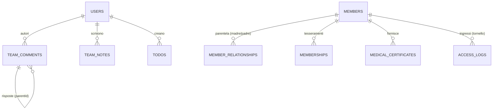
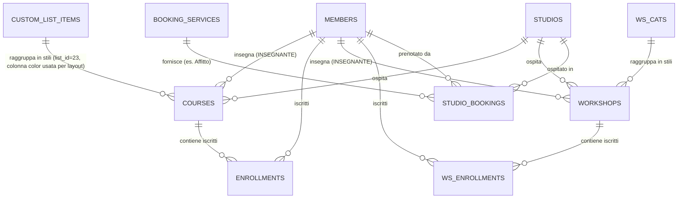
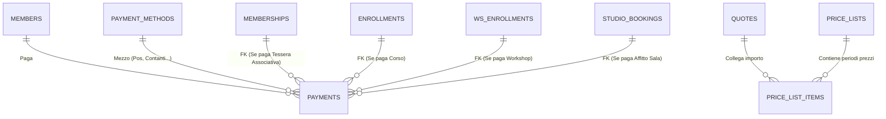

<!-- --- INIZIO SORGENTE: attuale/01_GAE_Database_Attuale.md --- -->

# CourseManager Database Map (Stato Attuale)

> [!NOTE] 
> **Scopo di questo documento**
> Questo file è la **Radiografia Attuale (Fase 1)** del backend di CourseManager. Descrive fedelmente l'esatta struttura dei dati e le 73 tabelle fisiche in uso *ora* nel `shared/schema.ts` (Drizzle ORM + MySQL). Consultalo come fonte di verità quando devi interagire con il database odierno, capire dove finiscono le righe dei "11 Silos" o tracciare come si collegano utenti, incassi e ricevute della Cassa Centrale.

Questo documento illustra la struttura completa delle tabelle del database e le loro relazioni, così come definite in `shared/schema.ts`. 
Il database utilizza un modello relazionale gestito tramite Drizzle ORM e MySQL.

### ⚠️ Differenza Importante con il file "03_GAE_Mappa_Pagine_Database.md"
*   **Questo File (1_)**: È il dizionario puramente **BackEnd e Architetturale (ERD)**. Da leggere quando si vuole capire come le tabelle sono legate tra loro a livello SQL (Relazioni, Chiavi Esterne, Drizzle ORM).
*   **Il File (3_)**: È la documentazione **FrontEnd e Navigazionale**. Da leggere quando si vuole capire "Se l'utente preme il bottone X sulla pagina `/calendario` o `/pagamenti`, in quale tabella finiranno i suoi dati?".

### 🔗 Documenti di Riferimento Architetturale (Da Leggere)
Per avere la visione d'insieme prima, durante e dopo i futuri refactoring, fai affidamento ai seguenti documenti analitici stilati:
* 🛡️ **[Progetto, Architettura e Collegamenti (Regole Auree)](02_GAE_Architettura_e_Regole.md)** -> Manuale per sviluppatori che spiega il nucleo "intoccabile" e le zone "sicure" dove espandere funzionalità oggi senza rompere nulla.
* 🚀 **[CourseManager Future Database Map (Single Table Inheritance)](../futuro/12_GAE_Database_Futuro_STI.md)** -> Il traguardo finale. Il blueprint del nuovo "Dynamic Activities Engine" a 3 livelli unificati, senza più duplicazioni o pagamenti orfani.
* 🛠️ **[Piano Lavoro Migrazione DB](../futuro/13_GAE_Piano_Migrazione_DB.md)** -> La checklist operativa con fasi e tempistiche stimate per passare dall'attuale struttura a quella futura.

---

## Moduli Logici (72 Tabelle Fisiche suddivise in 8 Macro-Aree)

L'attuale architettura Drizzle ORM / MySQL conta ben **72 tabelle fisiche**. Per renderne comprensibile la gestione, l'intero database è stato astratto in **8 macro-aree logiche** (Autenticazione, Configurazione, Località, Comunicazioni, Anagrafica, Attività, Servizi Extra, Finanza). Seguono i blocchi dettagliati:
### 1. Autenticazione & Utenti (Authentication & Users)
- **`users`**: La tabella base degli account per lo staff e gli operatori.
- **`user_roles`**: Ruoli generici e permessi scritti in JSON per gli utenti.
- **`sessions`**: Tabella Drizzle originale per jwt o vecchie gestioni sessione.
- **`express_sessions`**: Nuova tabella persistente generata da `express-mysql-session` per il mantenimento in vita dei login oltre il riavvio del processo Node.js.

#### ⏱️ Logica del "Tempo di Lavoro" e Presenza (Heartbeat)
Il calcolo di quanto un operatore resta "connesso" (Tempo di Lavoro) NON viene affidato al client (browser timer), ma è un algoritmo Server-Side "Anti-Fragile" residente in `routes.ts`:
1. **La Scintilla di Partenza:** Il tempo di lavoro nasce all'assegnazione persistente di `currentSessionStart` in tabella `users`.
2. **Il Radar a impulsi (Heartbeat):** Il client esegue check `/api/users/presence/heartbeat` continui. Questo rinnova costantemente l'impronta in backend (`lastSeenAt`) ma mantiene sigillato il `currentSessionStart`.
3. **Fattore "Tolleranza Urti":** A fronte di refresh completi del browser (F5), chiusura improvvisa o blackout WiFi, il proxy `/api/users/presence/offline` decreta lo status visivo "Offline", ma **non cancella la sessione master**. Il server estrae i minuti raggiunti transitoriamente salvandoli in `lastSessionDuration`.
4. **Morte Causale o Riconnessione (Tempo Netto e Pause):**
   * **Pausa Istantanea:** Se il mouse/tastiera è inattivo per 2 minuti, l'interfaccia entra in stato di Pausa (Giallo) silenziando il radar. Al rientro, il segnale "Sono Tornato" è istantaneo al primo movimento.
   * **Tempo Netto (L'esclusione della Pausa):** Se la pausa supera i 3 minuti, un algoritmo SQL retroattivo **sposta in avanti l'orario di `currentSessionStart`** di un lasso di tempo esatto pari alla pausa stessa. In questo modo l'interfaccia, pur riattivandosi, **scarta la pausa** dal totale calcolato mostrandoti esclusivamente il Tempo Netto lavorato!
   * **Se l'operatore scompare definitivamente:** Trascorsi i 20 Minuti dal `lastSeenAt`, il server decreta morta la vecchia sessione. Il tempo totale sarà identico all'ultimo secondo netto registrato.
5. **Chiusura volontaria:** Chiudere a mano l'interfaccia via "Logout" sdogana `/api/logout`, azzera il `currentSessionStart = null` e storicizza istantaneamente in `user_activity_logs` la label nativa *"Logout (Tempo di lavoro: Xh Ym)"*.

### 2. Configurazione Generale & Utility
- **`system_configs`**: Impostazioni globali chiave-valore del gestionale.
- **`custom_lists` / `custom_list_items`**: Liste semplici definite dall'utente (es. "Nomi Corsi", "Posti Disponibili").
- **`act_statuses`, `pay_notes`, `enroll_details`**: Etichette colorate multi-opzione utilizzate per taggare in modo differenziato le iscrizioni e i pagamenti.
- **`knowledge`**: Tooltip di aiuto e spiegazioni visibili nelle sezioni dell'interfaccia.
- **`user_activity_logs`**: Log di sistema per l'audit (tracciamento di chi ha fatto cosa).
- **`custom_reports`**: Definizioni salvate per la reportistica e l'estrazione dati personalizzata.
- **`import_configs`**: Configurazioni e mapping salvati per l'importazione di dati massivi nel sistema.

### 3. Località (Locations)
- **`countries`** -> **`provinces`** -> **`cities`**: Dati geografici strutturati in modo gerarchico (Nazioni, Province, Comuni con CAP).

### 4. Comunicazioni del Team
- **`messages`**: Messaggi diretti e privati tra gli utenti dello staff.
- **`team_comments`**: Conversazioni formattate a thread (simil-chat) per appunti dello staff. Supporta risposte nidificate (nested replies) tramite il campo `parentId`.
- **`team_notes`**: Note testuali interne, fissabili o meno in alto (pinned).
- **`todos`**: Lista condivisa delle cose da fare (Task semplici).
- **`notifications`**: Centro notifiche e avvisi centralizzati per l'interfaccia utente dello staff.

### 5. Entità Centrali (Anagrafica & Setup base)
- **`members`**: Il cuore assoluto del sistema (Allievi, Clienti, Partecipanti). Contiene dati anagrafici spesso "piatti" ma complessi, assieme a info mediche e generalità di minorenni/genitori.
- **`member_relationships`**: Raccordi parentali che legano i minorenni ai tutori legali (`mother`, `father`).
- **`cli_cats`**: Categorie Clienti per classificare l'utenza e gestire sconti o target specifici.
- **`members` (STI per Insegnanti)**: Gli Insegnanti (identificati da `participantType = 'INSEGNANTE'`), sono ora gestiti all'interno di `members`, e mantengono collegamenti alle rate `instr_rates` che ne definiscono la paga. (Ex tabella `instructors` eliminata).
- **`studios`**: Le aule mediche o sale fisiche in cui si svolgono le attività e si prendono appuntamenti.
- **`seasons`**: Definizioni temporali per l'anno sportivo o accademico (es. 2025-2026).

### 6. Le Attività Didattiche e Iscrizioni (I famosi "11 Silos")
L'erogazione delle discipline in CourseManager è attualmente frazionata su 11 gruppi di tabelle speculari, che condividono tutte la medesima struttura ma portano un nome e categorie diverse.
Ogni blocco ha:
1.  **Una Tabella Categoria Attività** (es. `categories`, `ws_cats`, `sun_cats`, ecc.) che definisce l'albero stilistico.
2.  **Una Tabella Attività** (es. `courses`, `workshops`, `sunday_activities`) che ospita il singolo evento, l'insegnante, l'orario e il prezzo base.
3.  **Una Tabella Iscrizioni** (es. `enrollments`, `ws_enrollments`, `sa_enrollments`) che collega i `members` (gli allievi iscritti) all'attività vera e propria.

I modelli parificati dei suddetti "11 silos" sono:
1.  **Corsi** (`courses`, `enrollments`)
2.  **Workshop** (`workshops`, `ws_enrollments`) [MIGRATE IN `courses` STI]
3.  **Prove Pagate** (`paid_trials`, `pt_enrollments`)
4.  **Prove Gratuite** (`free_trials`, `ft_enrollments`)
5.  **Lezioni Singole** (`single_lessons`, `sl_enrollments`)
6.  **Attività Domenicali** (`sunday_activities`, `sa_enrollments`) [DEPRECATO]
7.  **Allenamenti** (`trainings`, `tr_enrollments`) [DEPRECATO]
8.  **Lezioni Individuali** (`individual_lessons`, `il_enrollments`) [DEPRECATO]
9.  **Campus** (`campus_activities`, `ca_enrollments`) [MIGRATE IN `courses` STI]
10.  **Saggi / Spettacoli** (`recitals`, `rec_enrollments`) [DEPRECATO]
11.  **Vacanze Studio** (`vacation_studies`, `vs_enrollments`)
12. **[NEW] Tabelle Ombra STI** (`activities_unified`, `enrollments_unified`) - *Strato Data-Pump attualmente in sola lettura (Bridge API)*

*(Nota: Esistono anche le tabelle `attendances` e `ws_attendances` per tracciare le presenze, manualmente o tramite codice a barre).*

### 7. Tesseramenti & Servizi Extra (Bookings)
- **`booking_service_categories`** -> **`booking_services`**: Dizionario e Categorie Attività degli elementi extra-didattici prenotabili (come "Affitto Sala Medica" o "Personal Trainer").
- **`studio_bookings`**: Gli slot calendarizzati per prenotare fisicamente uno spazio ("studio") legato ad un servizio.
- **`memberships`**: Assicurazioni o tessere associative annuali (il "Tesseramento"). Include informazioni sul `membershipType` (Nuovo vs Rinnovo), la `seasonCompetence` (Corrente o Successiva) e autogenera i codici Barcode fisici.
- **`sub_types`**: Modelli e tipologie predefinite dei tesseramenti e abbonamenti (Subscription Types).
- **`medical_certificates`**: Tabella di raccordo per tracciare l'idoneità, le scadenze o le mancate consegne dei certificati medici degli atleti.
- **`access_logs`**: Tracce di passaggio derivanti dai tornelli e lettori barcode, indicanti entrata/uscita.

### 8. Gestione Finanziaria e Ricevute (Finances & Payments)
- **`price_lists` / `price_list_items`**: Griglie e matrici vincolate al tempo, che decidono i listini storici collegabili alle attività.
- **`quotes`**: Quote svincolate da importo standard fisso ("Quote Indipendenti").
- **`course_quotes_grid`**: Griglia per calcolo e creazione automatica delle matrici prezzi mensili per il modulo Q1C.
- **`payment_methods`**: Opzioni di transazione in fase di saldo (es. Cassa, Pos, Bonifico, PayPal).
- **`payments`**: **Il cuore vivo di ogni transazione economica.** Ciascun pagamento è vincolato forzatamente a un `member`, ed è costretto a dichiarare il proprio traguardo in una - e solo una - delle svariate Foreign Keys a disposizione (es., puntando formalmente verso `enrollment_id`, `ws_enroll_id`, o obbligatoriamente al `membership_id` per le quote sociali).

---

## Struttura ERD (Entity-Relationship Diagram) Scomposta

*Per ragioni di leggibilità (l'architettura a 11 silos renderebbe un unico diagramma illeggibile a schermo), la mappa dello stato attuale è divisa in tre macro aree.*

### 1. The Core (Anagrafiche, Genitori, Segreteria)
Questa è la base dati umana. Tutto parte dai `MEMBERS` (Allievi, Genitori, ecc.) o dagli `USERS` (Operatori System).

### 2. The 11 Activity Silos (L'Offerta Formativa Attuale)
Attualmente il sistema gestisce l'offerta didattica **duplicando la struttura di tabella** per ogni variante. Lo schema qui sotto per i **Corsi** e **Workshop** è ripetuto identico in altri 9 contesti (Campus, Domenicali, Lezioni Private, ecc.).

### 3. Finances & Payments (Il Crocevia dei Pagamenti)
Nello stato attuale, tutti i flussi di denaro e le ricevute finiscono nella grande e complessa tabella `PAYMENTS`. Essa possiede chiavi esterne multiple e opzionali verso ognuno degli "11 silos".

### Key Architectural Notes
- The database is heavily denormalized horizontally across the 11 activity types. While `courses` and `workshops` share exactly the same columns, they use distinct tables.
- The `payments` table acts as a massive junction point, containing foreign keys (`enrollment_id`, `ws_enroll_id`, `booking_id`, etc.) to point back to the origin of the transaction.
- Members contain highly flattened data regarding parents (e.g. `motherFirstName`, `fatherFirstName` are directly inside `members` when `isMinor` is true, backed up optionally by `member_relationships`).
- **[STI UPDATE]**: `courses.category_id` ora punta permanentemente a `custom_list_items` (ID>400), svincolandosi dalla legacy `categories`. I colori delle entità sono stoccati nativamente in `custom_list_items.color`.
- **[DEPRECATION & DROP COMPLETO]**: In Fase 32, i 16 silos ridondanti (workshops, trainings, individualLessons, sundayActivities, recitals, campus_activities, ecc.) assieme alle relative tabelle di `enrollments` **sono stati formalmente rimossi dal database**. L'API `activities-summary` e tutta la reportistica si basano in tempo reale al 100% su aggregazioni della supertabella `courses` tramite Single Table Inheritance. Schema pulito da tutte le refs legacy.

<!-- --- FINE SORGENTE: attuale/01_GAE_Database_Attuale.md --- -->

<!-- --- INIZIO SORGENTE: attuale/02_GAE_Architettura_e_Regole.md --- -->

# Progetto, Architettura e Collegamenti Database
> [!IMPORTANT] 
> **Scopo di questo documento**
> Questo file è le **Sacre Norme Tecniche del Sistema**. Spiega le logiche architetturali portanti del database, definendo i confini tra il *Nucleo Intoccabile* (dove non fare refactoring improvvisati pena la rottura degli algoritmi di calcolo rate e ricevute) e il *Terreno Sicuro* (dove è facile e privo di rischi aggiungere colonne e nuove entità). Da leggere e seguire religiosamente prima di qualsiasi implementazione che tocchi schema e rotte API.

*Documento di riferimento tecnico per futuri interventi strutturali su CourseManager*
 

### 🔗 Documenti Correlati (Da Leggere)
Per avere una visione completa dello stato del software e della sua evoluzione, consulta obbligatoriamente anche questi due documenti complementari:
1. **[Registro Ultimi Aggiornamenti](../../GAE_ULTIMI_AGGIORNAMENTI.md)** -> Contiene lo storico dettagliato (Changelog) di tutte le modifiche, fix e nuove feature sviluppate di recente.
2. **[Piano Architettura Futura (Single Table Inheritance)](../futuro/12_GAE_Database_Futuro_STI.md)** -> Contiene l'analisi avanzata (Entity-Relationship Diagram e Vocabolario) su come trasformare l'attuale struttura a "12 silos" in un unico motore dinamico in caso di refactoring totale.

Questo documento spiega le **logiche portanti** ("intoccabili") del database e i **margini di flessibilità** (dove è possibile e sicuro intervenire), allo scopo di guidare gli sviluppatori futuri su come estendere il software senza corrompere o frammentare l'ecosistema esistente.
Il database è interamente definito nel file `/shared/schema.ts` (Drizzle ORM + MySQL).

---

## 0. STRATEGIA OPERATIVA E CHANGE CONTROL (Stop & Go)
In virtù dell'approccio di Sviluppo Modulare Veloce e della potenziale alta distruttività di refactoring non calcolati in un gestionale SaaS con 73 tabelle, vige una **Regola Permanente di Change Control** applicabile a qualsivoglia sviluppatore o Agente AI.

Prima di procedere con modifiche che impatteranno o refattorizzeranno l'architettura viva, file sorgenti, JSX components critici o il database, **È OBBLIGATORIO FERMARSI E PRODURRE QUESTO REPORT ANALITICO ALL'UTENTE:**
1. **Modifica proposta** (il piano d'azione).
2. **Perché serve** (il razionale pratico).
3. **File coinvolti** (sorgenti in lettura e scrittura).
4. **Impatti previsti** (cosa cambierà all'utente segreteria).
5. **Rischi / regressioni possibili** (i side-effect su vecchi record o rotte limitrofe).
6. **Cosa NON verrà toccato** (il perimetro d'azione da salvaguardare).

> **🛑 REGOLA INFRANGIBILE (Stop & Go):**
> È fatto assoluto divieto procedere alla modifica reale del codice una volta presentato il report in implementation_plan. Lo sviluppatore o l'AI deve mettersi **in attesa passiva di approvazione esplicita** da parte del CTO/Project Manager. Niente salti in avanti per "efficienza presunta". 

---

## A. Manifesto Architetturale e Visione Prodotto
Ogni sviluppatore che contribuisce a CourseManager deve aderire a questi principi:
1. **Nessun "Cappotto su Misura":** Il gestionale risolve oggi i problemi di StarGem, ma **non** deve essere limitato dalle regole di un singolo centro. L'architettura deve rimanere modulare, scalabile, estendibile, multi-sede e multi-tenant (SaaS).
2. **Evoluzione Controllata (Nessun Rewrite Totale):** L’obiettivo primario è portare il gestionale in produzione in tempi brevi, tutelando il lavoro svolto. Sono vietate le riscritture totali da zero o l'over-engineering prematuro. La priorità è: stabilizzare i flussi core, chiudere le falle architetturali gravi (es. Pagamenti Orfani) e accettare esplicitamente il resto come debito tecnico documentato per future iterazioni.
3. **Sviluppo Parallelo:** Il DB e le interfacce devono poter essere toccate da più team simultaneamente. Questa cartella `_GAE_SVILUPPO` è la costituzione che garantisce la non-collisione (es. usando il Pattern Factory / Drizzle Router unificati).
4. **Coerenza Evolutiva (Pragmatismo):** Nei nuovi task la prima domanda è: *"Cosa serve davvero per lavorare presto?"*. Le decisioni devono risolvere il blocco odierno, unificare i data-source sparsi (es. Tessere vs members), lasciando però intatti e inalterati i settori funzionanti non essenziali. Progetta per il futuro, ma implementa solo ciò che serve ora.
5. **Modello Persone Fluido:** Non esistono tabelle isolate per "Collaboratori", "Studenti" o "Affittuari". In CourseManager un `member` o uno `user` può essere simultaneamente Tesserato, Insegnante, Staff, Esterno, tramite etichette di ruolo dinamiche.

## B. Contesto Operativo Reale (Stato Dati e Infrastruttura)

### Infrastruttura Cloud (Phase 26)
Il progetto è operativo su un ecosistema indipendente e scalabile che bypassa server legacy condivisi.
*   **Server Produzione:** VPS IONOS (`82.165.35.145`) con Ubuntu 24.04.
*   **Database Produzione:** L'applicazione legge/scrive sul DB locale `stargem_v2` (MariaDB 11.4).
*   **Sviluppo Locale (Regola d'Oro):** Dato che la porta 3306 sul VPS è chiusa per sicurezza, lo sviluppo locale del codice dal Mac non comunica direttamente all'IP esterno. **Deve rigorosamente essere avviato il Tunnel SSH** (`bash scripts/tunnel-db.sh`) prima di `npm run dev`. In questo modo, il local host inganna NodeJS facendogli credere che il DB sia su `127.0.0.1:3307`. Questa operazione garantisce privacy totale sui dati e zero esposizione ad attacchi bruteforce remoti su MariaDB.
*   **Deploy Workflow:** La logica procede da Git su GitHub → Fetch/Pull dal pannello Plesk → Operatività Node build → Riavvio del demone tramite PM2.

### Dinamiche dei Dati
*   **Gestione Non in Produzione Estesa:** Il gestionale sta venendo costruito ad-hoc su database vivi. I dati anagrafici attualmente immessi sono **record ibridi** importati a scopo di stress-test. Possono risultare storpiati o orfani.
*   **Integrazione Attesa:** La bonifica formale del DB di produzione avverrà prelevando gli storici reali da fonti decentralizzate (fogli G-Sheet, export PDF, Athena Portal, TeamSystem).
*   **Ecosistema Allargato:** Nei quarter futuri il CMS `studio-gem.it` (WooCommerce/WordPress) verrà integrato al db, rendendo i listini comunicanti.

---

## 1. Il Nucleo "Intoccabile" (o "Rischioso")
L'architettura ha alcune colonne portanti che strutturano l'intero gestionale. Se modificate pesantemente in modo improprio, si va a rompere il funzionamento di incassi, ricevute ed elenchi in tutto il software (Frontend e Backend). In particolare i vocabolari a tendina (`custom_lists`) agiscono da vettori logici iniettabili traversalmente a tutte le entità tramite incrocio JSON (`linked_activities`).

### A. La divisione in 12 Moduli "A Silos" (Didattica + Affitti)

> [!NOTE]
> **Disallineamento Architettura DB vs UI Pagamenti (Aggiornamento)**
> Sebbene l'architettura database conti empiricamente 12 moduli tabellari fisici per iscrizioni/prenotazioni, l'**UI Frontend (Modale Pagamenti ed elenchi hub)** è guidata dall'`ACTIVITY_REGISTRY` che espone **14 Entità Logiche** distinte (separando nettamente "Allenamenti" da "Affitti", e includendo placeholder puramente contabili senza tabella di enrollment come "Merchandising"). Il sistema di pagamento gestisce fluidamente le voci extra tramite fallback su transazioni generiche (`type: "other"`) slegate dai silos didattici.

> [!CAUTION]
> **Policy Obbligatoria di Migrazione Dati (Update in-place)**
> Le tabelle strutturali (come `custom_lists` e `custom_list_items`) dipendono rigorosamente da vincoli *ON DELETE CASCADE*. In **Produzione**, per alterare il significato di liste storiche, è **tassativamente vietato** eseguire script di "Delete + Recreate", in quanto l'eliminazione del padre vaporizzerebbe istantaneamente i valori storicamente collegati.
> La migrazione corretta e obbligatoria per prevenire perdite dati DEVE avvenire tramite **Rename / Update in-place** condizionato (Es: `UPDATE custom_lists SET name='Generi', system_code='generi' WHERE name='Nomi Corsi'`). Solo dopo aver blindato i dati esistenti, si creano i nuovi rami.

Le 12 tipologie (tutte con struttura fisica identica per la parte didattica, ma tabelle DB separate) sono:
1.  **Corsi** (`courses`, `enrollments`)
2.  **Workshop** (`workshops`, `ws_enrollments`)
3.  **Prove Pagate** (`paid_trials`, `pt_enrollments`)
4.  **Prove Gratuite** (`free_trials`, `ft_enrollments`)
5.  **Lezioni Singole** (`single_lessons`, `sl_enrollments`)
6.  **Attività Domenicali** (`sunday_activities`, `sa_enrollments`)
7.  **Allenamenti** (`trainings`, `tr_enrollments`)
8.  **Lezioni Individuali** (`individual_lessons`, `il_enrollments`)
9.  **Campus** (`campus_activities`, `ca_enrollments`)
10. **Saggi / Spettacoli** (`recitals`, `rec_enrollments`)
11. **Vacanze Studio** (`vacation_studies`, `vs_enrollments`)
12. **Eventi Esterni / Prenotazioni** (`booking_services`, `studio_bookings`) - *Spesso contato come il 12° "Silo" ad uso non didattico, ma con proprio flusso pagamenti. Nota (Marzo 2026): A livello di categorie, "Affitti" (Rentals) e "Merchandising" sono stati estratti in tabelle indipendenti (`rental_categories` e `merchandising_categories`) smantellando il sovraccarico legacy su Eventi Esterni.*

💡 **REGOLA D'ORO:** L'idea di unificare ora tutte e 12 le tabelle in una sola sarebbe un disastro informatico (refactoring totale impensabile). Qualsiasi nuova funzionalità logica (es. "aggiungere limitazioni sull'età") **deve essere propagata e considerata su tutte le tabelle simultaneamente** per non creare squilibri nell'interfaccia. 
Inoltre, quando si fa un inserimento da Front-End (es. tramite la *Maschera Input* o la nuova Modale Unificata del *Calendario*), questa funge da smistatore (Mimetismo STI) che disaccoppia il payload e reindirizza trasparentemente il salvataggio ai legacy endpoint corretti a seconda di quale attività l'operatore seleziona dalla tendina, preservando l'integrità dei silos.

### B. Il sistema Centrale dei Pagamenti (`payments`)
La tabella `payments` è l'**Hub di interscambio** ("Junction Table") del comparto economico.
* Tutta l'amministrazione, bilanci, calcoli rata e solleciti vertono inesorabilmente qui.
* Quando un pagamento viene registrato, contiene un *Foreign Key* (id esterno) che lo ancora fisicamente alla sua origine.
* Poiché esistono 12 tipologie di prenotazione/iscrizione, la tabella dei pagamenti contiene 12 colonne relazionali diverse (es. `enrollment_id` per i corsi, `ws_enroll_id` per i workshop, `booking_id` per le sale mediche, ecc.).
* Modificare come i pagamenti si allacciano a sconti/iscrizioni è l'operazione più a rischio bug per l'intera parte contabile.

### C. Il Nodo "Tessere" (`memberships`) e il Checkout
La tessera associativa in CourseManager **non** è una banale etichetta testuale, né un "Prodotto E-Commerce", ma un oggetto transazionale primario.
* **Priorità Assoluta:** La tessera sblocca il carrello. Niente pagamento quota, niente erogazione dell'attività. Le due cose sono asservite l'una all'altra.
* **Vincolo Assoluto:** La `membership` deve nascere solo ed esclusivamente all'interno di un flusso coerente con un Pagamento effettivo (registrato in `payments` con la foreign key `membership_id` debitamente popolata e agganciata). Non possono esistere tessere slegate dal flusso economico.
* **Problema Attuale (Marzo 2026) [RISOLTO!]:** Attualmente la `Maschera Input` creava tessere "orfane" dal carrello. Il salvataggio del modulo iniettava l'incasso nel Libro Mastro (`payments`), fallendo nell'agganciare tale record all'ID della nuova tessera. Il bug è stato **risolto in via definitiva** istruendo il framework transazionale a eseguire un "Incrocio ID" forte. Il Frontend ora emette `tempId: membership_fee` abbinato a un `referenceKey` fiscale. Il Backend (`routes.ts`) recupera al volo il `membershipId` nativo e salda i record assieme in parentesi atomica. Se si cancella il pagamento, la tessera ora decade propriamente a pending. Questo Matcher Multi-Persona risolve specialmente i checkout parentali (es. genitore che paga 2 tessere distinte per i 2 figli nello stesso carrello).
* **Dipendenze:** La validità del tesseramento sblocca o meno l'erogazione delle restanti attività.

---

## 2. Il "Terreno di Gioco" (Dove è Sicuro Intervenire)
Fortunatamente il database, per come è strutturato, è molto permissivo se si interviene in "maniera orizzontale" allacciando nuove cose invece di distruggere le vecchie.

### A. Modificare / Espandere le Anagrafiche (`members`)
L'anagrafica dei tesserati (tabella `members`) è completamente "piatta". Questo significa che i dati familiari, fiscali, e di contatto risiedono quasi per intero sotto il record della singola persona (ad esempio `motherFirstName` vive in `members` sotto condizione `isMinor=true` senza quasi richiedere join con altre tabelle genitori).
* ✅ **SICURO:** È semplicissimo aggiungere nuovi campi come "Livello Abilità", "Polo/Sede di provenienza", "Professione", "Taglia Maglietta", allargando i moduli di salvataggio nella pagina di iscrizione o le interfacce utente senza il rischio di mandare in crash altro.

### B. Gestione Interventi Frontali (UI) e "Maschera a Cascata"
La Maschera Input Generale (il form `maschera-input-generale.tsx`) è concepita come un form multi-step o un blocco unico dinamico. È molto resiliente.
* ✅ **SICURO:** Si possono nascondere, mostrare dinamicamente o concatenare nuovi campi da far compilare all'operatore in segreteria. Il Front-End in React non è fragile, accetta facilmente campi addizionali.

### C. Estendere i Dettagli Corsi (Metadati)
* ✅ **SICURO:** Possiamo aggiungere dati descrittivi supplementari nativi ai corsi/eventi (es. "Lista equipaggiamento", "Livello di Difficoltà") inserendo semplicemente il campo nella rispettiva tabella `courses`, `workshops`, ecc. Questo non va a nuocere per niente a pagamenti e iscrizioni, basta implementare la visibilità della colonna nel modulo prescelto.

### D. Reportistica, Dashboards e Statistiche (Read-Only)
* ✅ **SICURO:** Qualsiasi lettura, interpretazione o statistica calcolata sui dati (PDF di fine mese, export Excel degli iscritti, grafici delle frequenze, automazioni) prenderà dati già normalizzati e inseriti senza mai interferire con il funzionamento core del database. Generare viste e cruscotti è sempre un'operazione non invasiva.

### E. Automazioni Secondarie e Note di Sistema
Tabelle come `todos`, `team_notes`, `team_comments` (oggi strutturato a "Thread" tipo chat utente per utente) sono architettiuri leggere che non interagiscono con pagamenti e iscrizioni. 
* ✅ **SICURO:** Lavorare per aggiungere badge, remind, alert (es. "Ricorda rinnovo tessera"), promemoria o checklist al team è una zona quasi totalmente libera da rischi per la base del sistema.

---

## 3. Flusso di Lavoro Consigliato (Best Practice)
Quando decidi che vuoi inserire una nuova feature importante dentro l'ecosistema, il flusso decisionale dovrebbe essere:

1. Chiediti: *"Questo dato impatterà in qualche modo su QUANTO l'utente paga la retta finale?"* 
   * Se NO, procedi libero e a spron battuto. 
   * Se SÌ, fai prima un check approfondito nel Backend (`server/routes.ts` - `api/payments`) per capire come inserirlo nel calcolo delle rate in fase di submit.
2. Intervieni sulla singola riga della tabella in `/shared/schema.ts`.
3. Assicurati che se la modifica riguarda "un'attività", venga implementata per lo meno sulle tabelle gemelle di punta (Corsi, Workshop).
4. Sfrutta il "Zod Validation" per proteggere l'input da dati incorretti dal frontend.

---

## 4. Estensibilità: Come aggiungere una 13ª Attività
Nonostante i silos separati richiedano più lavoro di copia-incolla, aggiungere un nuovo modulo (es. "Eventi Esterni") è un pattern procedurale standard. Ecco i file esatti da toccare:

1. **Database (`shared/schema.ts`)**:
   * Creare le 3 tabelle gemelle (es. `external_events_cats`, `external_events`, `ee_enrollments`).
   * Aggiungere la foreign key in `payments` (es. `ee_enroll_id`).
   * Aggiungere le relazioni `relations(member, ...)` in fondo al file.
2. **Backend API (`server/routes.ts`)**:
   * Clonare le CRUD operations di un modulo esistente (es. i corsi o i workshop). Creare gli endpoint `GET`, `POST`, `PUT`, `DELETE`.
   * Aggiungere la gestione del nuovo `ee_enroll_id` nella generica rotta dei pagamenti `/api/payments`.
3. **Frontend Interfaccia (`client/src/pages/`)**:
   * Duplicare la pagina frontend (es. `pages/corsi.tsx` diventerà `pages/eventi-esterni.tsx`).
   * Aggiungere la voce nel menu laterale in `components/layout/Sidebar.tsx`.
   * Integrare la compilazione nella `maschera-input-generale.tsx` aggiungendo un nuovo Tab o Opzione.

## 5. Rischio Dispersione Dati e Integrità
Il rischio principale di questa struttura a "12 rami" è la frammentazione se l'utente sbaglia o se si elimina un record "madre". Ecco come è gestito attualmente e cosa monitorare:

* **Eliminazione a Cascata (`onDelete: "cascade"`)**: Quasi tutte le tabelle dipendenti (es. le iscrizioni) hanno la cancellazione a cascata. Se elimini un Membro, spariscono le sue iscrizioni. Se elimini un Corso, spariscono le iscrizioni a quel corso. *Attenzione: i pagamenti però non sempre spariscono a cascata per fini contabili.*
* **Punto di rottura (La "Maschera Generale")**: Se si crea una logica complessa in `maschera-input-generale.tsx`, bisogna fare molta attenzione a smistare correttamente i dati verso il Backend. Se un pagamento viene salvato senza l'`enrollment_id` corretto della specifica attività, si crea un pagamento "orfano" (si prendono i soldi, ma il sistema non sa per quale attività esatta).
* **Soluzione**: Quando si cercano errori contabili, la prima cosa da fare è interrogare la tabella `payments` e verificare che almeno uno dei 12 `foreign_key` (es. `enrollment_id`, `booking_id`, ecc.) sia valorizzato. Se sono tutti `null`, il pagamento si è perso nel limbo.

---

## 6. Proposte Architetturali per il Miglioramento (Roadmap)

In base all'analisi della struttura a 12 moduli (11 attività + Servizi Extra/Prenotazioni), ecco due accorgimenti tecnici raccomandati per stabilizzare e scalare il sistema futuro:

### A. Unificare il Routing Backend (Pattern Factory/Adapter)
*   **Problema:** Avere 12 set di rotte API separati con logiche CRUD quasi identiche porta a duplicazione di codice ed elevato rischio di bug quando si modifica una logica trasversale.
*   **Soluzione:** Implementare un pattern "Factory" in `server/routes.ts`. Una funzione `createActivityHandler(activityType)` che riceve il nome della tabella dinamicamente e genera in automatico tutti gli endpoint `GET`, `POST`, `PUT`, `DELETE`.
*   **Vantaggio:** Aggiungere un 13° modulo richiederà pochissime righe di codice invece di centinaia. La manutenzione diventerà centralizzata.

### B. Prevenire i "Pagamenti Orfani" (Strict Validation)
*   **Problema:** Se la Maschera Input ha un'anomalia, si rischia di inviare un pagamento valido ma senza allegare l'ID dell'attività corrispondente. I soldi risultano in cassa, ma non si sa a cosa sono riferiti.
*   **Soluzione Backend:** Nel blocco `POST /api/payments` del server, aggiungere una validazione ferrea (tramite `zod` o if-statement manuale). Il sistema deve **rifiutare fisicamente** la ricezione di un pagamento se tutte le 12 `foreign_key` (es. `enrollment_id`, `membership_id`, `ws_enroll_id`...) sono vuote. L'unica eccezione validata è un caricamento "borsellino elettronico" generico.
*   **Soluzione Frontend:** Disabilitare il bottone "Salva Pagamento" in `maschera-input-generale.tsx` finché il payload non contiene l'ID esatto del corso/servizio selezionato. Meno codice opaco, più sicurezza contabile. La maschera produce il match anche su carrelli multi-utente inviando il `referenceKey`.

### C. Normalizzazione Selettori UI (Esito Audit e Blocco 5)
*   **Problema:** L'interfaccia utente soffriva (e in parte soffre) di "Hardcoding Mockup". Molte tendine fondamentali per il business (es. `Dettaglio Iscr.` in Nuovo Pagamento, `Province` in Maschera Input, `Tipologia` in Planning) non pescavano i dati da un database reale, ma da array statici fittizi.
*   **Soluzione Architetturale e Piano Esecutivo:** Ogni "Select" o "Combobox" applicativo è stato diviso in 4 matrici (Condiviso, Specifico, Amministrativo, Mockup) che hanno dettato il **Piano Esecutivo di Normalizzazione (Blocco 5)**:
    *   **Quick Wins (Consentiti):** Creazione nuovi vocabolari dinamici sicuri come `Livello` (in `custom_lists`), aggancio tabelle esistenti (es. `client_categories`), pulizia form dummies (`Comuni`).
    *   **Costanti Temporali/Amministrative (Lasciati tali):** Elementi fissi (`WEEKDAYS`, `Tipologia Tessera`) restano hardcoded in frontend per efficienza e immutabilità. Non verranno db-izzati.
    *   **STOP & GO Finanziario (Congelati):** Tutte le select della Cassa (`Metodo Pagamento`, `Dettaglio Iscr. Mockup`) sono tassativamente congelate per non rischiare regressioni sui salvataggi JSON legati alle fees tessere. Qualsiasi refactor al carrello richiederà un task blindato a parte.

---

## 6-bis. Calendario Operativo ↔ Regia Planning (Mapping 2026)
Nell'operatività reale front-desk, il tempo non viene visualizzato in unico calderone, ma segue uno schema gerarchico a 3 layer da preservare senza refactoring distruttivi:
1. **Modulo Sorgente Attività (SQL):** I dati reali nascono sempre dalle tabelle silenziose (`courses`, `campuses` ecc.). Nessun dato nasce dal Calendario UI.
2. **Calendario Attività (Route `/calendario-attivita`):** È la **Vista Tattica a Slot (Day-by-Day)**. Serve puramente al front-desk per l'operatività immediata: vedere chi è prenotato e dove nel dettaglio orario. 
3. **Planning (Route `/planning`):** È la **Vista Strategica e di Regia**. Serve alla Direzione per governare il macro-scheduling. Ragiona per mesi.

### Classificazione delle 14 Attività Ufficiali
Come concordato, queste sono le regole di rendering per evitare forzature a frontend:

| # | Attività | Calendario (Orario/Daily)? | Planning (Stagionale)? | Natura |
|---|---|:---:|:---:|---|
| 1 | **Corsi** | ✅ SI | ✅ SI (Aggregati) | Strutturale fissa |
| 2 | **Workshop** | ✅ SI | ✅ SI | Evento mirato orario |
| 3 | **Prove a pagamento** | ✅ SI | ❌ NO | Occasionale/Tattico |
| 4 | **Prove gratuite** | ✅ SI | ❌ NO | Occasionale/Tattico |
| 5 | **Lezioni singole** | ✅ SI | ❌ NO | Prenotazione oraria |
| 6 | **Lezioni individuali** | ✅ SI | ❌ NO | Slot personalizzato |
| 7 | **Domenica in movimento**| ✅ SI | ✅ SI | Flash Event orario |
| 8 | **Allenamenti** | ✅ SI | ❌ NO | Slot affitto libero orario |
| 9 | **Affitti** | ✅ SI | ❌ NO | Spazio orario / Booking |
| 10| **Campus** | ✅ SI | ✅ SI | Strutturale Plurigiornaliero |
| 11| **Saggi** | ❌ NO | ✅ SI | Evento Macro |
| 12| **Vacanze studio** | ❌ NO | ✅ SI | Esterno Plurigiornaliero |
| 13| **Eventi esterni** | ❌ NO | ✅ SI | Evento / Trasferta |
| 14| **Merchandising** | ❌ NO | ❌ NO | **Solo hub vendita.** |

*Diagnosi Attuale:* Il Calendario carica già molto bene Corsi, Workshop e Affitti grazie ad `unifiedEvents`. Il resto è ancora affidato parzialmente a listini e backend legacy separati.
*Prossimo step prudente:* Completare l'import in `calendar.tsx` (`unifiedEvents`) per agganciare Lezioni Singole/Individuali e Allenamenti al grid tattico. Evitare refactoring DB, mappare e normalizzare solo lato JSX.

**Debito Tecnico Tollerato (Prenotazione Spazi ed Esterni):**
*In nome dell'"Evoluzione Controllata", le schermate "Prenotazione Sale" (es. `studio_bookings`) e roba esterna (es. `booking_services`), pur essendo logicamente assimilabili alle attività core, **RESTANO COME SONO** e in voci di menu a sé stanti. Non si deve tentare un rewrite totale per fonderle forzatamente nel Calendario Attività SQL. La loro lettura unificata avverrà per interpolazione Software in React (es. `CalendarEvent[]`), prestando attenzione a non usare classi CSS compilate dinamicamente (altrimenti Tailwind PurgeCSS le sopprime) ma mappando i colori per via statica o inline hex.*

---

## 7. Appendice: Note sul Refactoring "Factory" (Branching e Tempistiche)

Nel caso si decida in futuro di applicare l'unificazione del routing (Punto 6.A), ecco il piano operativo per mitigare i rischi e lavorare in sicurezza:

*   **Pattern Git Branching:** Il refactoring **non** deve avvenire sul ramo `main`. Verrà creato un ramo sperimentale (es. `refactor-api-factory`). Su questo ramo verranno cancellati i 12 file di routing e creata la funzione unica. Il resto del team potrà continuare a lavorare sul ramo `main` senza interruzioni.
*   **Impatti e Rischi Sperimentali:** Il rischio principale è disallineare il Frontend (es. una pagina chiama `/api/courses` ma il factory si aspetta un altro nome tabella) o perdere logiche "custom" presenti solo su un'attività specifica. Usando un branch separato, questi bug verranno risolti senza toccare la produzione.
*   **Tempistiche stimate (Backend + Test):** Circa 1-2 giornate lavorative (8-12 ore). Create la funzione base (1-2h), migrare i 12 moduli (2-3h), adattare il frontend lato chiamate API (1h) e testare pesantemente ogni tipologia di iscrizione (2h+).
*   **Merge Conflict:** Al momento di unire (Merge) il branch sperimentale con il `main`, eventuali aggiunte fatte dai colleghi nei vecchi file di routing (ormai cancellati nel branch) appariranno come conflitti e andranno integrate manualmente nella nuova logica Factory prima di chiudere.

---

## 8. Il Sogno Proibito: Unificazione Fisica (Single Table Inheritance)

Nel momento in cui si volesse riscrivere l'appliance da zero per garantire massima scalabilità (senza dover riprogrammare nulla quando si inventano nuovi tipi formativi), il modello teorico ottimale prevederebbe l'abbandono delle 11 tabelle separate in favore di una **Rigida Gerarchia a 3 Livelli** (Documentata estesamente in `database_map_future.md`).

Questo modello azzera il debito tecnico e previene alla radice i "Pagamenti Orfani", avendo un'unica colonna FK in amministrazione.

### L'Alberatura Universale a 3 Livelli (Vocabolario Ufficiale)
Per evitare fraintendimenti di dominio, la struttura deve seguire questi nomi esatti (Mental Model per Database e Interfaccia Utente):

1.  **Macro-Attività (`activities` o `services`)**
    Il grande "contenitore" fiscale e aggregativo.
    *   *Esempi:* CORSI, WORKSHOP, CAMPUS, AFFITTI SALE (Booking), ecc.
2.  **Categorie (`categories`)**
    Gli stili, i rami principali o le sotto-discipline appartenenti alla Macro-Attività.
    *   *Esempi:* Aerial, Danza, Ballo, Fitness, Gioco e Musica, ecc.
3.  **Dettaglio Attività / Singolo Corso (`activity_details`)**
    L'istanza fisica in cui si suda e si insegna (con il suo livello, istruttore e orario).
    *   *Esempi (corso di):* Pilates, Capoeira, Heels, Video Dance, Salsa, ecc.
    *   *Livello:* Open, Avanzati, Gestanti. Attenzione: **i livelli NON sono categorie**, ma sono esclusivamente degli **attributi** del singolo Corso/Dettaglio.

4.  **Iscritti (`enrollments`)**
    Le persone si legano **esclusivamente** al Livello 3 (Dettaglio). Se pagano il Dettaglio, il sistema sa già implicitamente a quale Categoria e a quale Macro-Attività appartiene l'incasso.

> **Aggiornamento Architetturale (Naming Consistency):** Il termine legacy "Nomi Corsi" è completamente deprecato in favore di **"Genere"** (System Code: `genere`). Tutte le 14 attività implementano la tendina dinamica `Combobox` agganciata a questa singola sorgente lista.

<!-- --- FINE SORGENTE: attuale/02_GAE_Architettura_e_Regole.md --- -->

### Modulo Quote e Promo (Fase Completata)
Sviluppato schema DB con 7 tabelle centrali integrate. Le custom list ora supportano in modo stabile le property estese dei Wallet Types.

### Struttura Contabile Base (Fase Completata)
Costruite le fondamenta per il futuro modulo contabilità, prima nota e controllo di gestione.
Oggi i dati in questa sezione sono scritti prevalentemente come proiezioni dai moduli operativi di incasso per permettere reportistica in sola scrittura.
Tabelle incluse in questo gruppo: `cost_centers`, `accounting_periods`, `journal_entries`. Estesa la tabella `payments` con `accounting_code`, `vat_code` e `cost_center_code`.

### Sistema Agevolazioni (Fase Completata)
Aggiunta la struttura isolata e future-proof per tracciare sconti, convezioni e tariffe speciali. Estesa `promo_rules` con tracciamento `approved_by` per autorizzazioni.
Tabelle create:
- `member_discounts`: Associa ad un utente uno sconto specifico o un override manuale con indicazione dell'autorizzazione.
- `company_agreements`: Elenco di convenzioni aziendali (es. Bocconi, Forze dell'Ordine) con regole fiscali custom applicabili (Corsi, Merch).
- `staff_rates`: Tariffe esclusive annuali o forfettarie da applicare allo staff interno.

### Prezzi Dinamici e Carnet Avanzati (Fase Completata)
Estesa l'architettura dei wallet per gestire scenari custom, maggiorazioni complesse e lezioni a domicilio.
- `carnet_wallets`: Aggiunti i campi avanzati `group_size`, `location_type`, `price_per_unit`, `total_paid` e `bonus_units` per tracciare il numero di allievi in un pack, l'eventuale sede esterna (domicilio) e i pacchetti pre-pagati omaggio.
- `pricing_rules`: Nuova tabella rules-engine per il calcolo dinamico. Consente configurazione di override scalari (es: +5€ per allievo extra over 3, lezione omaggio per fine pack, maggiorazione domicilio +10€ o +100€).
- `price_matrix`: Popolata programmaticamente come base-truth con 22 varianti di prezzo fisse per lezioni individuali private (in sede, domicilio, coppia e aerea) e per gli affitti location (singoli, pack e per l'intera accademia).

---

## 9. Mappatura Front-end Login vs Database (Suite StarGem)
Questa sezione decodifica la relazione tra i moduli commerciali mostrati sulla schermata di **Login** ("La Suite StarGem") e l'architettura tecnica del database:

| Dicitura Login | Descrizione a Schermo | Tabelle DB di Riferimento |
| :--- | :--- | :--- |
| **`GemTeam`** | *Team & HR* | Si appoggia a `users` e `user_roles` per gli accessi fisici, e `staff_rates` per le paghe. |
| **`Gemory`** | *Project Manager* | Comunicazione p2p: `todos`, `team_notes`, `team_comments`. |
| **`Gemdario`** | *Calendario* | Motore STI: Interroga brutalmente `courses` e `enrollments`. |
| **`BookGem`** | *Aule & Booking* | Interroga `studios` e `studio_bookings`. |
| **`MedGem`** | *Studio Medico* | Alimentato in toto da `medical_certificates` e `members`. |
| **`Clarissa`** | *CRM & Marketing* | Attualmente legge i tag da `members`. Predisposto in futuro per logiche DEM. |
| **`GemStaff`** | *Staff Manager* | Modulo in divenire per automatizzare marketing, amministrazione e conformità burocratica collaboratori. |
| **`TeoCopilot`** | *AI Aziendale* | Read-only. Genera query SQL o supporto alle UI tramite AI e `knowledge`. |

---

## 10. Il Potenziale Inespresso: Integrazioni Periferiche (Roadmap)
Il motore centrale è pronto. Per scalare SaaS al 100%, la roadmap prevede l'implementazione periferica di questi 5 nuovi moduli (i "pezzettini" futuri):

1. **CRM e Marketing Automation (Clarissa Attiva):**
   *Manca:* `marketing_campaigns`, `email_logs_history`, `automation_rules`.
   *Scope:* Invio automatico SMS per certificati scaduti o email di re-engagement dopo inattività.
2. **Modulistica e Firma Digitale Front-Desk (Kiosk Mode):**
   *Manca:* `member_forms_submissions` (JSON payload + firma) e UI su iPad.
   *Scope:* Sostituzione cartacea per consensi Privacy, GDPR, Anamnesi Sportiva, agganciati nativamente a `member_id`.
3. **Gestione Scorte, Buvette e POS:**
   *Manca:* `inventory_items`, `stock_movements`.
   *Scope:* Vendita prodotti fisici (Gatorade, magliette) scalando quantità scorte, agganciabile al Borsellino Elettronico del membro.
4. **GemStaff (Motore HR e Conformità Collaboratori):**
   *Manca:* `staff_shifts`, `payslips`, `staff_contracts_compliance`.
   *Scope:* Trasformare la mera anagrafica collaboratori in un motore digitale integrato. Automatizzerà la conformità burocratica (es. controllo durc, scadenze contratti sportivi), calcolo cedolini presenze live e marketing/reclutamento risorse umane dell'accademia.
5. **L'Area Personale Cliente (Self-Service Mobile):**
   *Manca:* Modulo Client-Facing (App/Web).
   *Scope:* Il cliente si autentica, paga una `quote` arretrata con Stripe e si prenota autonomamente un posto in un `course`.
