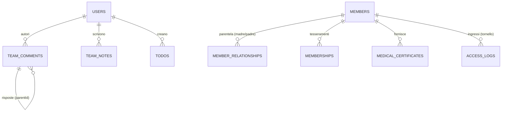
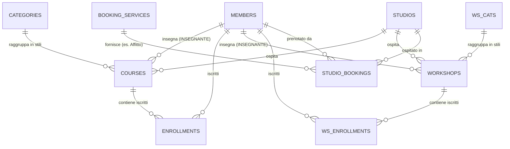
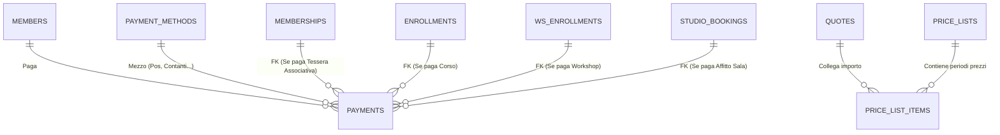

# CourseManager Database Map (Stato Attuale)

> [!NOTE] 
> **Scopo di questo documento**
> Questo file è la **Radiografia Attuale (Fase 1)** del backend di CourseManager. Descrive fedelmente l'esatta struttura dei dati e le 73 tabelle fisiche in uso *ora* nel `shared/schema.ts` (Drizzle ORM + MySQL). Consultalo come fonte di verità quando devi interagire con il database odierno, capire dove finiscono le righe dei "11 Silos" o tracciare come si collegano utenti, incassi e ricevute della Cassa Centrale.

Questo documento illustra la struttura completa delle tabelle del database e le loro relazioni, così come definite in `shared/schema.ts`. 
Il database utilizza un modello relazionale gestito tramite Drizzle ORM e MySQL.

### ⚠️ Differenza Importante con il file "03_GAE_Mappa_Pagine_Database.md"
*   **Questo File (1_)**: È il dizionario puramente **BackEnd e Architetturale (ERD)**. Da leggere quando si vuole capire come le tabelle sono legate tra loro a livello SQL (Relazioni, Chiavi Esterne, Drizzle ORM).
*   **Il File (3_)**: È la documentazione **FrontEnd e Navigazionale**. Da leggere quando si vuole capire "Se l'utente preme il bottone X sulla pagina `/calendario` o `/pagamenti`, in quale tabella finiranno i suoi dati?".

### 🔗 Documenti di Riferimento Architetturale (Da Leggere)
Per avere la visione d'insieme prima, durante e dopo i futuri refactoring, fai affidamento ai seguenti documenti analitici stilati:
* 🛡️ **[Progetto, Architettura e Collegamenti (Regole Auree)](02_GAE_Architettura_e_Regole.md)** -> Manuale per sviluppatori che spiega il nucleo "intoccabile" e le zone "sicure" dove espandere funzionalità oggi senza rompere nulla.
* 🚀 **[CourseManager Future Database Map (Single Table Inheritance)](../futuro/12_GAE_Database_Futuro_STI.md)** -> Il traguardo finale. Il blueprint del nuovo "Dynamic Activities Engine" a 3 livelli unificati, senza più duplicazioni o pagamenti orfani.
* 🛠️ **[Piano Lavoro Migrazione DB](../futuro/13_GAE_Piano_Migrazione_DB.md)** -> La checklist operativa con fasi e tempistiche stimate per passare dall'attuale struttura a quella futura.

---

## Moduli Logici (73 Tabelle Fisiche suddivise in 8 Macro-Aree)

L'attuale architettura Drizzle ORM / MySQL conta ben **73 tabelle fisiche**. Per renderne comprensibile la gestione, l'intero database è stato astratto in **8 macro-aree logiche** (Autenticazione, Configurazione, Località, Comunicazioni, Anagrafica, Attività, Servizi Extra, Finanza). Seguono i blocchi dettagliati:
### 1. Autenticazione & Utenti (Authentication & Users)
- **`users`**: La tabella base degli account per lo staff e gli operatori.
- **`user_roles`**: Ruoli generici e permessi scritti in JSON per gli utenti.
- **`sessions`**: Archiviazione dei dati di sessione (login attivi).

### 2. Configurazione Generale & Utility
- **`system_configs`**: Impostazioni globali chiave-valore del gestionale.
- **`custom_lists` / `custom_list_items`**: Liste semplici definite dall'utente (es. "Nomi Corsi", "Posti Disponibili").
- **`act_statuses`, `pay_notes`, `enroll_details`**: Etichette colorate multi-opzione utilizzate per taggare in modo differenziato le iscrizioni e i pagamenti.
- **`knowledge`**: Tooltip di aiuto e spiegazioni visibili nelle sezioni dell'interfaccia.
- **`user_activity_logs`**: Log di sistema per l'audit (tracciamento di chi ha fatto cosa).
- **`custom_reports`**: Definizioni salvate per la reportistica e l'estrazione dati personalizzata.
- **`import_configs`**: Configurazioni e mapping salvati per l'importazione di dati massivi nel sistema.

### 3. Località (Locations)
- **`countries`** -> **`provinces`** -> **`cities`**: Dati geografici strutturati in modo gerarchico (Nazioni, Province, Comuni con CAP).

### 4. Comunicazioni del Team
- **`messages`**: Messaggi diretti e privati tra gli utenti dello staff.
- **`team_comments`**: Conversazioni formattate a thread (simil-chat) per appunti dello staff. Supporta risposte nidificate (nested replies) tramite il campo `parentId`.
- **`team_notes`**: Note testuali interne, fissabili o meno in alto (pinned).
- **`todos`**: Lista condivisa delle cose da fare (Task semplici).
- **`notifications`**: Centro notifiche e avvisi centralizzati per l'interfaccia utente dello staff.

### 5. Entità Centrali (Anagrafica & Setup base)
- **`members`**: Il cuore assoluto del sistema (Allievi, Clienti, Partecipanti). Contiene dati anagrafici spesso "piatti" ma complessi, assieme a info mediche e generalità di minorenni/genitori.
- **`member_relationships`**: Raccordi parentali che legano i minorenni ai tutori legali (`mother`, `father`).
- **`cli_cats`**: Categorie Clienti per classificare l'utenza e gestire sconti o target specifici.
- **`members` (STI per Insegnanti)**: Gli Insegnanti (identificati da `participantType = 'INSEGNANTE'`), sono ora gestiti all'interno di `members`, e mantengono collegamenti alle rate `instr_rates` che ne definiscono la paga. (Ex tabella `instructors` eliminata).
- **`studios`**: Le aule mediche o sale fisiche in cui si svolgono le attività e si prendono appuntamenti.
- **`seasons`**: Definizioni temporali per l'anno sportivo o accademico (es. 2025-2026).

### 6. Le Attività Didattiche e Iscrizioni (I famosi "11 Silos")
L'erogazione delle discipline in CourseManager è attualmente frazionata su 11 gruppi di tabelle speculari, che condividono tutte la medesima struttura ma portano un nome e categorie diverse.
Ogni blocco ha:
1.  **Una Tabella Categoria Attività** (es. `categories`, `ws_cats`, `sun_cats`, ecc.) che definisce l'albero stilistico.
2.  **Una Tabella Attività** (es. `courses`, `workshops`, `sunday_activities`) che ospita il singolo evento, l'insegnante, l'orario e il prezzo base.
3.  **Una Tabella Iscrizioni** (es. `enrollments`, `ws_enrollments`, `sa_enrollments`) che collega i `members` (gli allievi iscritti) all'attività vera e propria.

I modelli parificati dei suddetti "11 silos" sono:
1.  **Corsi** (`courses`, `enrollments`)
2.  **Workshop** (`workshops`, `ws_enrollments`)
3.  **Prove Pagate** (`paid_trials`, `pt_enrollments`)
4.  **Prove Gratuite** (`free_trials`, `ft_enrollments`)
5.  **Lezioni Singole** (`single_lessons`, `sl_enrollments`)
6.  **Attività Domenicali** (`sunday_activities`, `sa_enrollments`)
7.  **Allenamenti** (`trainings`, `tr_enrollments`)
8.  **Lezioni Individuali** (`individual_lessons`, `il_enrollments`)
9.  **Campus** (`campus_activities`, `ca_enrollments`)
10.  **Saggi / Spettacoli** (`recitals`, `rec_enrollments`)
11.  **Vacanze Studio** (`vacation_studies`, `vs_enrollments`)
12. **[NEW] Tabelle Ombra STI** (`activities_unified`, `enrollments_unified`) - *Strato Data-Pump attualmente in sola lettura (Bridge API)*

*(Nota: Esistono anche le tabelle `attendances` e `ws_attendances` per tracciare le presenze, manualmente o tramite codice a barre).*

### 7. Tesseramenti & Servizi Extra (Bookings)
- **`booking_service_categories`** -> **`booking_services`**: Dizionario e Categorie Attività degli elementi extra-didattici prenotabili (come "Affitto Sala Medica" o "Personal Trainer").
- **`studio_bookings`**: Gli slot calendarizzati per prenotare fisicamente uno spazio ("studio") legato ad un servizio.
- **`memberships`**: Assicurazioni o tessere associative annuali (il "Tesseramento"). Include informazioni sul `membershipType` (Nuovo vs Rinnovo), la `seasonCompetence` (Corrente o Successiva) e autogenera i codici Barcode fisici.
- **`sub_types`**: Modelli e tipologie predefinite dei tesseramenti e abbonamenti (Subscription Types).
- **`medical_certificates`**: Tabella di raccordo per tracciare l'idoneità, le scadenze o le mancate consegne dei certificati medici degli atleti.
- **`access_logs`**: Tracce di passaggio derivanti dai tornelli e lettori barcode, indicanti entrata/uscita.

### 8. Gestione Finanziaria e Ricevute (Finances & Payments)
- **`price_lists` / `price_list_items`**: Griglie e matrici vincolate al tempo, che decidono i listini storici collegabili alle attività.
- **`quotes`**: Quote svincolate da importo standard fisso ("Quote Indipendenti").
- **`course_quotes_grid`**: Griglia per calcolo e creazione automatica delle matrici prezzi mensili per il modulo Q1C.
- **`payment_methods`**: Opzioni di transazione in fase di saldo (es. Cassa, Pos, Bonifico, PayPal).
- **`payments`**: **Il cuore vivo di ogni transazione economica.** Ciascun pagamento è vincolato forzatamente a un `member`, ed è costretto a dichiarare il proprio traguardo in una - e solo una - delle svariate Foreign Keys a disposizione (es., puntando formalmente verso `enrollment_id`, `ws_enroll_id`, o obbligatoriamente al `membership_id` per le quote sociali).

---

## Struttura ERD (Entity-Relationship Diagram) Scomposta

*Per ragioni di leggibilità (l'architettura a 11 silos renderebbe un unico diagramma illeggibile a schermo), la mappa dello stato attuale è divisa in tre macro aree.*

### 1. The Core (Anagrafiche, Genitori, Segreteria)
Questa è la base dati umana. Tutto parte dai `MEMBERS` (Allievi, Genitori, ecc.) o dagli `USERS` (Operatori System).

### 2. The 11 Activity Silos (L'Offerta Formativa Attuale)
Attualmente il sistema gestisce l'offerta didattica **duplicando la struttura di tabella** per ogni variante. Lo schema qui sotto per i **Corsi** e **Workshop** è ripetuto identico in altri 9 contesti (Campus, Domenicali, Lezioni Private, ecc.).

### 3. Finances & Payments (Il Crocevia dei Pagamenti)
Nello stato attuale, tutti i flussi di denaro e le ricevute finiscono nella grande e complessa tabella `PAYMENTS`. Essa possiede chiavi esterne multiple e opzionali verso ognuno degli "11 silos".

### Key Architectural Notes
- The database is heavily denormalized horizontally across the 11 activity types. While `courses` and `workshops` share exactly the same columns, they use distinct tables.
- The `payments` table acts as a massive junction point, containing foreign keys (`enrollment_id`, `ws_enroll_id`, `booking_id`, etc.) to point back to the origin of the transaction.
- Members contain highly flattened data regarding parents (e.g. `motherFirstName`, `fatherFirstName` are directly inside `members` when `isMinor` is true, backed up optionally by `member_relationships`).
