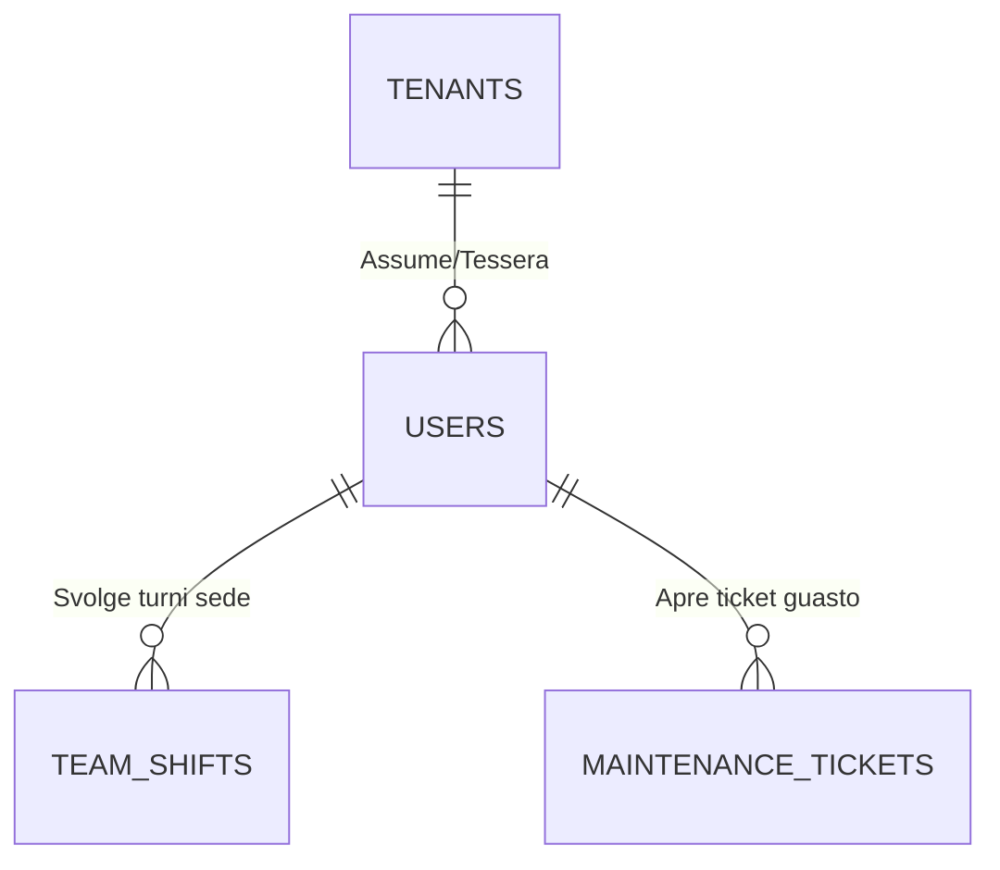
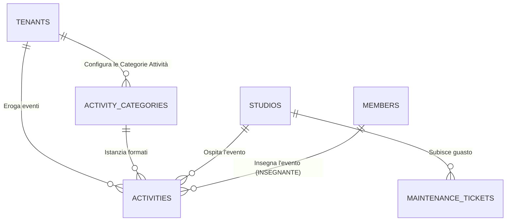
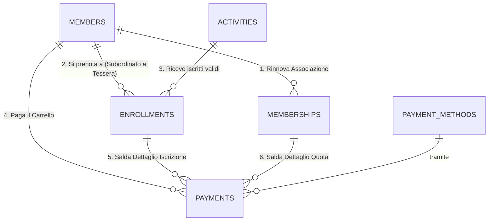

<!-- --- INIZIO SORGENTE: futuro/12_GAE_Database_Futuro_STI.md --- -->

# Analisi Strategica per l'Ottimizzazione del Database (CourseManager)

> [!IMPORTANT] 
> **Scopo di questo documento**
> Questo file rappresenta l'**Analisi Strategica e il Business Case (Fase 3)** per il refactoring del Database di CourseManager. Spiega *perché* stiamo passando dalla vecchia struttura a 11 silos alla nuova architettura SaaS (Single Table Inheritance), illustrando i vantaggi matematici del taglio delle tabelle e elencando rigorosamente tutte le eccezioni commerciali (prenotazioni, carnet, capienze, ecc.) che il nuovo motore dovrà gestire nativamente.

Alla luce delle indagini condotte sullo stato dell'arte del gestionale, emerge una forte asimmetria tra la complessità visiva per l'utente (ben mascherata) e l'attuale complessità logica del backend. 

Il database attuale è composto da **73 tabelle fisiche**, suddivise logicamente in **5 Macro-Aree**. Il "debito tecnico" primario risiede interamente nell'Area 1 ("Moduli Core: Attività e Corsi"), la quale adotta un approccio a *silos separati* (copia-incolla strutturale per 11 tipologie diverse di offerta didattica).

Questo documento illustra la mia proposta di intervento tecnico, numerico e procedurale per risolvere il problema alla radice senza causare disservizi.

---

## 1. Fotografia del Problema: L'Architettura a "11 Silos"
Attualmente, se la segreteria crea un nuovo "Corso", i dati finiscono nella tabella `courses`. Se crea un "Workshop", finiscono in `workshops`. Se crea un "Campus", finiscono in `campus_activities`. 
Questa totale **separazione fisica** di entità che condividono il **100% della stessa natura logica** (hanno tutte un orario, un istruttore, una sala e un prezzo) comporta tre gravi reazioni a catena:

1. **Ridondanza delle Tabelle (Sprawl):** Per erogare 11 tipologie di attività, il sistema ha generato a cascata 11 tabelle per l'evento, 11 tabelle per le categorie e 11 tabelle per tenere traccia delle iscrizioni. Parliamo di **circa 34 tabelle su 73** (quasi metà del database) che fanno letteralmente la stessa identica cosa ma con nomi diversi.
2. **Caos Contabile (Il collo di bottiglia "Payments"):** La tabella sovrana `payments`, dovendo emettere ricevute, è costretta a ospitare 12 chiavi esterne (Foreign Keys) differenti (es. `enrollment_id`, `ws_enroll_id`, `pt_enroll_id`) per sapere "a quale silo" è agganciato un dato incasso. Questo rende le query lente e la diagnostica complessa.
3. **Rigidità delle Interfacce UI:** Avendo 11 rami backend separati, in React sono nate decine di pagine frontend clonate e disallineate tra loro (es. componenti dissimili per l'inserimento degli orari o visualizzazione partecipanti).

---

## 2. La Soluzione Proposta: "Single Table Inheritance" (Dynamic Engine)

La mia proposta per ottimizzare il gestionale punta a un trapianto architetturale verso il modello **Single Table Inheritance** (STI). Crolleremo gli 11 *silos* in un unico "Motore Dinamico", eliminando la duplicazione e centralizzando i flussi.

### Dove Interverrei e Quante Tabelle Toccherei
L'intervento andrebbe a intaccare **principalmente le ~34 tabelle del Modulo 1 (Core)**, lasciando quasi del tutto intoccati i Moduli 3 (Anagrafiche) e 4 (Struttura).

Ecco come cambierebbe il conteggio e la suddivisione:

*   **11 Tabelle Categorie -> Diventano 1 Tabella (`categories`)**
    Tutte le materie (es. Hip Hop, Calisthenics, English Camp) convergeranno qui. Un campo `activity_type` (Enum: 'course', 'workshop', 'campus') le differenzierà logicamente, non fisicamente.
*   **11 Tabelle Evento -> Diventano 1 Tabella (`activity_details`)**
    Le vecchie `courses`, `workshops`, ecc. collassano nell'unica tabella "Offerta". Avrà i medesimi campi per tutti: `startTime`, `endTime`, `instructorId`, ecc.
*   **11 Tabelle Iscritti -> Diventano 1 Tabella (`enrollments`)**
    Tutte le partecipazioni degli allievi confluiranno qui. Spariranno `ws_enrollments`, `sa_enrollments`, ecc.
*   **Gestione `payments` (Semplificazione)**
    I pagamenti non avranno più 12 chiavi di collegamento orfane. Il pagamento punterà unicamente a `enrollments_id` (che a sua volta saprà a quale macro-attività riferirsi).

### Il Risultato Numerico
Dalle attuali **73 Tabelle**, scenderemmo drasticamente a circa **45 o 50 Tabelle totali**. Significa **eliminare definitivamente ~30 tabelle clonate**, smaltendo migliaia di righe di codice ORM inutile su Node.js. 

---

## 3. RoadMap di Intervento: Come Mimetizzarsi senza Fare Danni

Trasformare il cuore del database a sistema "in volo" è l'operazione più rischiosa in ingegneria del software. 
Ecco la mia proposta di intervento, articolata per evitare qualsiasi blocco del lavoro della segreteria:

### Fase 1: Sviluppo Silente (Shadow Mode)
1. Creo un **Branch Isolato** su Git (nessuna modifica avverrà in produzione).
2. Costruisco le **3 nuove Super-Tabelle** (`categories_v2`, `activity_details`, `enrollments_v2`) dentro Drizzle ORM senza toccare o cancellare le vecchie 34 tabelle.
3. Inietto uno "Script Ombra" (Data Pump) che cicla sui vecchi corsi e workshop e li "ricopia" costantemente nelle nuove 3 tabelle unificate per assicurarmi che il mapping dei vecchi dati funzioni perfettamente.

### Fase 2: Unificazione delle Interfacce (UI Refactoring)
*   Sfruttando il branch isolato, distruggo le decine di varianti delle schermate di iscrizione e dei planning in React.
*   Costituisco **un unico "Micro-Form" universale** per i pagamenti e gli inserimenti orario.
*   Lo collego esclusivamente alle nuove Super-Tabelle unificate.

### Fase 3: Il Cut-Over (Il Trapianto)
*   Quando avremo testato (sempre nel branch sperimentale) che il Gestionale riesce a iscrivere, incassare e stampare report usando SOLO il motore unificato a 3 tabelle, organizzeremo il "Cut-Over".
*   In un momento di fermo del centro (es. domenica notte o prima mattina), si lancia l'aggiornamento finale: si pusha il branch, si cancellano fisicamente (Drop) le vecchie ~30 tabelle a silos obsolete e si passa alla produzione col nuovo motore ad alte prestazioni.

---

## 4. Requisiti di Business (Le Regole d'Oro per la nuova Architettura)

A seguito dell'intervista diretta con l'amministrazione (Marzo 2026), sono emerse le **eccezioni fisiche e contabili** che il nuovo motore univoco (`activity_details` ed `enrollments`) dovrà saper gestire nativamente. 

### 🚀 Obiettivo Finale: Architettura SaaS (Software as a Service)
Il sistema è in fase di re-ingegnerizzazione non solo per ottimizzare le prestazioni locali, ma con l'obiettivo commerciale di diventare un prodotto scalabile e rivendibile ad altre scuole/centri (Multi-tenant).
Le 4 Macro Tabelle (`activities`, `activity_categories`, `activity_details`, `enrollments`) e il comparto contabile dovranno essere progettati in modo da non avere *nessuna logica hardcoded* (es. vietato scrivere nel codice *"se è Danza fai X"*), demandando alla UI la creazione libera di regole e settaggi profilati per il futuro cliente finale.

> [!WARNING]
> **Vincolo di Dominio: Non siamo un E-Commerce Puro**
> Nonostante l'agilità SaaS, il software resta un Gestionale Sportivo. Lo sbarramento istituzionale (Tessera Associativa, Certificato Medico, Assicurazioni) DEVE precedere obbligatoriamente lo sblocco dei carrelli e delle erogazioni delle attività. La tessera sblocca il carrello. I pagamenti sono uniti in transazioni multi-persona.

### A. Corsi Annuali e Capienze
*   **Ciclo Annuale:** Abbonamento fisso (Settembre-Giugno). Disdetta assente, consentita pura sospensione.
*   **Capienza Rigorosa:** Le tabelle necessitano di un cap limit (`max_capacity`).
*   **Lista d'Attesa (Waiting List):** Se una disciplina è satura, non si blocca l'inserimento ma il record in `enrollments` andrà formalmente in stato `waiting_list`.

### B. Lezioni Private e Carnet a Scalare
*   **On-Demand:** Per l'1-to-1, l'activity si crea *on the fly* sulla chiamata.
*   **Gestione Carnet:** Occorrono abbonamenti di tipo "A scalo" (es. Carnet 10 ingressi). La futura tabella per le quote e iscrizioni deve saper immagazzinare gli *ingressi residui* (Punch Card logic).

### C. Affitti Sale e Listini Multipli
*   **Booking Grid:** Il front-end avrà bisogno di un calendario a slot incastrabili (1h, 50m, 2h).
*   **Pricing Dinamico:** Il calcolatore prenderà in input due varianti determinanti per l'affitto: *Durata* e *User Role* (es. Sconto se Tesserato o Staff).

### D. Grandi Eventi e Payload Dinamici
*   **Acconto (Deposit) / Saldo:** Pagamento *una tantum* ma con possibilità tecnica di separare un Acconto immediato da un Saldo dovuto entro poche settimane (nessuna rateizzazione esterna).
*   **Dati Volatili (JSON Payload):** Nelle Vacanze Studio servono box extra volatili (Taglia maglietta, Trasporto, Patologie dietetiche). Invece di far generare ad-hoc nuove colonne MySQL per magliette o bus, integreremo un campo potente `extra_info` descritto in architettura come JSON.

### F. Tesseramenti (Memberships) e Sicurezza
*   **Validità Configurabile:** Il sistema SaaS deve supportare scadenze fisse (es. 1° Sett. - 31 Ago. a 25€) o date rolling. 
*   **Obbligatorietà Flessibile:** Il tesseramento è mandatorio (anche per Staff e invio dati a Enti sportivi terzi), ma il motore deve prevedere dei bypass logici in prevendita (es. consentire l'acquisto di una prima prova senza tessera e obbligarla allo step successivo).

### G. Shop e Servizi Extra (Vendite Passive)
*   **Voci Fuori-Orario:** Il sistema deve permettere la vendita di entità "piatte" e slegate temporalmente (es. Affitto Armadietto, Lucchetto, Merchandising).
*   **Gestione Giacenze (Stock):** Per gli oggetti fisici sarà implementato un modulo di *Inventario* elementare (Carico/Scarico) che inibisca l'acquisto al termine della disponibilità, pronto a recepire logiche attualmente rodate dall'amministrazione su fogli GSheet esterni.

### H. Eventi Singoli, Ticketing e Provvigioni
*   **Saggi e Ticketing Singolo:** Nessun pagamento a "famiglie", ogni iscritto o ospite esterno acquista il proprio quantitativo di slot/biglietti (sia online che in segreteria).
*   **Split Payments (Provvigioni Insegnanti):** Un requisito infrastrutturale di *massima importanza*. La tabella che aggancia gli Insegnanti all'Evento Didattico deve poter scartare la classica tariffa oraria per ospitare contratti "A Percentuale %" basati sul numero reale di allievi iscritti incassati. Il db governerà un flag temporaneo di "Visibilità" per consentire al docente di sbirciare l'andamento iscrizioni in autonomia.

### J. Integrazione Fiscale (Tax API)
*   **Documentazione Elettronica:** La tabella transazioni (`payments`) dovrà disporre di colonne hook pronte (es. `receipt_status`, `rt_transaction_id`) per dialogare via API con Registratori Telematici o gestionali di contabilità esterni, superando le "ricevute pro-forma" interne.

### K. Interfacciamento Hardware (IoT Access Control)
*   **Lettura Autonoma:** La tabella delle presenze (`attendances`) andrà cablata per accettare ping elettronici. Tramite un `barcode_uuid` in anagrafica, telecamere Face ID, lettori QR/Barcode al banco registreranno automaticamente l'ingresso scalando "carnet" dal wallet o registrando la pura presenza.

### L. Gestione Crediti (Wallet Recurrency)
*   **Addebito SEPA/Stripe:** Le iscrizioni (`enrollments`) dovranno supportare lo status *Recurrent*. L'architettura deve prevedere la rateizzazione garantita dell'intera stagione (impedendo logiche di un-subscribe immediate furbette).

### M. Scalabilità Multi-Tenant e Multi-Sede (Enterprise)
*   **La Colonna `location_id`:** Ognuna delle quattro Super-Tabelle avrà obbligatoriamente un field per discernere la Sede (Milano, Monza, ecc.).
*   **Impermeabilità Parziale:** Il DB deve gestire iscritti multi-sede, ma sopratutto Insegnanti condivisi tra più edifici aziendali.
*   **Integrazione Extramoenia:** Il Planner Insegnanti deve consentire l'inserimento di "Slot Occupati Generici" per calcolare la disponibilità dell'insegnante anche quando *lavora per la concorrenza* o in associazioni non affiliate, schermando conflitti orari nel nostro planning.

### N. Modulo Risorse Umane (HR & Payroll)
*   **Timbratura Insegnanti:** Verrà strutturata la tabella `instructor_attendances` per certificare *quando* e *quanto* un maestro ha fisicamente presenziato a lezione.
*   **Reportistica Paghe:** Lo scontro tra le "Ore Svolte x Tariffa Oraria" (oppure x % Provvigione) fornirà alla dirigenza un prospetto cedolini matematicamente esatto a fine mese.

### O. Software Gestionale HR & Maintenance (Nuovo Modulo)
*   **Separazione Logica Ruoli:** Oltre al mero controllo accessi, l'RBAC (Role-Based Access Control) su database dovrà discernere nettamente tra "Staff" (Insegnanti Didattici) e "Team" (Amministrativi, Ispettori, Receptionist), fornendo viste distinte.
*   **Shift Management (Turni):** Creazione della tabella `team_shifts` associata ad aule/reception per cadenzare gli orari di lavoro del personale dipendente tramite l'App o Portale a loro dedicato.
*   **Manutenzione Strutturale:** Istanziazione della tabella `maintenance_tickets` connessa alle Aule/Studi. Permetterà all'App del personale ispettivo di aprire segnalazioni tecniche (es. guasti) con stati d'avanzamento, isolando il workflow dalla messaggistica generale o dai Todo standard.
*   **Comunicazioni Broadcast:** Potenziamento delle attuali tabelle `messages`, `todos` e `team_comments` per trasformare l'interfaccia dell'App Dipendenti nel vero *cuore comunicativo* a circuito chiuso.

### P. Checkout Orientato all'Affiliazione 
*   **Priorità della Membership:** Nessuna ricevuta commerciale può essere chiusa in assenza di uno status assicurativo/sportivo "Active".
*   **Carrello Multi-Persona:** Il Checkout non è intestato a chi preme il tasto "Paga", ma supporta l'aggregazione di figli/familiari. Il matchin contabile avviene tramite UUID temporanei (es. `membership_fee_12A4`) che sciolgono il legame a valle nel Database SQL in modo atomico.

---

## 5. CourseManager Future Database Map (Single Table Inheritance)

**Perché è stata stilata questa analisi?** 
Questa proposta architetturale nasce dall'esigenza di risolvere un problema strutturale acuto: la frammentazione delle Attività. Inizialmente, il sistema era stato concepito in modo grossolano (molto probabilmente hard-coded pensando a solo due o tre tipologie di offerta). Con l'espansione del gestionale e l'aggiunta logica di diverse ATTIVITÀ separate (12 fino ad oggi), questo design "a silos copiati" si è rivelato insostenibile da mantenere e soggetto a errori. Ora che abbiamo compreso che le "Attività" del centro (Corsi, Eventi, Workshop, Affitti) sono e saranno in continua, potenziale espansione, è fondamentale ripensare il cuore del database per assorbirle in modo dinamico.

Questo documento illustra la struttura futura di CourseManager, pensata per eliminare la frammentazione a "12 silos" e rendere il sistema scalabile all'infinito tramite un approccio unificato (Factory Pattern/Single Table Inheritance).

### 🔗 Documenti di Riferimento Architetturale (Da Leggere)
Per avere la visione d'insieme prima, durante e dopo i futuri refactoring, fai affidamento ai seguenti documenti analitici stilati:
* 🗃️ **[CourseManager Database Map (Stato Attuale)](../attuale/01_GAE_Database_Attuale.md)** -> La radiografia visiva dell'ecosistema odierno a "11 silos". Spiega come tutto confluisce faticosamente nella tabella `payments`.
* 🛡️ **[Progetto, Architettura e Collegamenti (Regole Auree)](../attuale/02_GAE_Architettura_e_Regole.md)** -> Manuale per sviluppatori che spiega il nucleo "intoccabile" e le zone "sicure" dove espandere funzionalità oggi senza rompere nulla.
* 🛠️ **[Piano Lavoro Migrazione DB](13_GAE_Piano_Migrazione_DB.md)** -> La checklist operativa con fasi e tempistiche stimate per passare dall'attuale struttura a quella futura.

---

## La Filosofia del Nuovo Sistema

L'obiettivo è trasformare il Gestionale da una struttura "rigida" (dove ogni nuovo corso richiede di clonare intere tabelle e file API) a una struttura Dinamica e Universale. Esistono due livelli in cui questa unificazione può avvenire:

1. **Unificazione Logica (Soft Refactoring - Factory API)**: Il database mantiene le 12 tabelle attuali per sicurezza, ma il Backend (Node.js) usa un unico motore (Factory) per gestirle tutte.
2. **Unificazione Fisica (Hard Refactoring - Single Table Inheritance)**: Il database stesso viene ricostruito per usare un'unica grande tabella `activities` e un'unica tabella `enrollments`.

Di seguito viene esplorata la Unificazione Fisica (La VERA mappa futura), che rappresenta lo stato dell'arte per un gestionale moderno.

---

## Logical Modules (Future State)

I moduli 1 (Authentication), 2 (Config), 3 (Locations), 4 (Team) e 7 (Memberships) rimarranno strutturalmente immutati rispetto allo stato dell'arte attuale.

Il cambiamento massivo avviene sui **Moduli 5, 6 e 8** (Anagrafiche, Attività e Pagamenti), che verranno rifondati e centralizzati.

### 5. Core Entities (Immutato, con agganci semplificati)
- **`members`**: The heart of the system.
- **`members` (STI per Insegnanti)**: Teachers (Identificati tramite `participantType`). La tabella autonoma `instructors` è stata deprecata in favore della Single Table Inheritance (STI).
- **`studios`**: Physical rooms/halls.

### 6. The Unified Activity Engine (SaaS / Single Table Inheritance)
Tutto l'apprendimento, insegnamento e l'offerta al pubblico si condenserà in sole 4 super-tabelle scalabili (agnostiche) disegnate nel draft Drizzle V2:

1. **`tenants` (Root Aziendale / Whitelabeling)**
   - Definisce la Palestra/Scuola che usa l'applicativo. Contiene Logo, Colori Aziendali e customizzazione del menu (`custom_menu_config`).
   
2. **`activity_categories` (Il "Pre-Seed" e UI Router delle Categorie Attività)**
   - Non solo testuale ("Danza"), ma contiene la colonna vitale `ui_rendering_type` che istruisce il frontend su come stampare i form, accompagnata dal payload JSON `extra_info_schema` per i campi volanti (es. Taglia Maglietta).

3. **`activities` (La Super-Tabella Eventi)**
   - Unica tabella fisica che sostituisce i famigerati 11 Silos. Contiene Corsi, Affitti, Eventi Esterni.
   - *Key Columns:* `tenant_id`, `category_id`, `location_id`, `start_time`, `end_time`, `instructor_id`, `max_capacity`, `base_price`, `extra_info_overrides` (JSON).

4. **`enrollments` (L'Iscrizione Universale)**
   - Registra le partecipazioni di chiunque a qualsiasi `activity_id`.
   - *Key Columns:* `status` (active, waiting_list, frozen), `remaining_punch_cards` (Carnet ingressi), `wallet_credit` (Buoni Rimborso), prelevando il metadata JSON dalla categoria padre.

### 8. Gestione Operativa, HR & Evoluzione Periferica
In ottica Enterprise, il sistema astrae la logica del team da quella didattica tramite moduli dedicati alla comunicazione inter-team e facility. Il gestionale è progettato nativamente per assorbire un'espansione perimetrale progressiva:
- **`team_shifts`**: Griglia temporale dedicata all'amministrazione per le timbrature presenze (Payroll) e sostituzioni docenti.
- **`maintenance_tickets`**: Segnalazioni guasti sale/facilities gestibili dallo Staff con transizioni di stato.
- **`team_comments`** e **`todos`**: Workspace di comunicazione a thread nidificati (nested chat) e chore-list collaborativa per connettere operativamente la segreteria.
- **Suite Amministrativa (Contabilità V2):** Oltre alle receipts di base, il db V2 ospiterà **Prima Nota**, bilancio incassi/uscite periodici, compensi docenti a ROI e Controllo di Gestione avanzato.
- **Ecosistema App Decentralizzate:** La lettura del database verrà esposta ad interfacce atomiche per l'**App Cliente** (Self-service e acquisti Stripe), l'**App Staff/Insegnanti** (Timbratura, visualizzazione quote compensi) e App **Front-Desk/Totem** (Acquisti snelli da ingresso palestra).
- **Access Control Evoluto:** Il layer accessi non si fermerà al check del "barcode". I tornelli domotici/app-desk interrogheranno il db per emettere stati compositi valutando simultaneamente: *stato tessera, validità certificato medico, controllo quote pendenti insolute e note operative d'emergenza*. Supporto futuro a QR Code dinamici e tessere dematerializzate in Wallet iOS/Android.

### 9. Finances & Payments (Rivoluzionato)
- **`payments`**: La transazione contabile. Nel nuovo sistema **non avrà più 12 colonne FK orfane**.
- Punterà esclusivamente alla combo: `member_id` e id di `enrollments`. Si aggiungono hook API per **Registratori Telematici Fiscale** e logiche ricorrenti per **Stripe/SEPA**.

---

## Entity-Relationship Diagrams (Future ERD)

Per massimizzare la leggibilità, l'architettura futura è stata divisa in tre mini-diagrammi focali. Questo approccio modulare (Anagrafica, Attività, Pagamenti) permette di comprendere i confini esatti di ogni responsabilità del nuovo sistema SaaS.

### 1. Diagramma Anagrafiche e Staff
Questo primo schema illustra le fondamenta del sistema: l'organizzazione (Tenant), gli account di accesso (Users/Staff) e il legame con i moduli HR e di Manutenzione Strutturale.

### 2. Diagramma del Motore Attività (Dynamic Engine)
Il cuore pulsante del nuovo gestionale. Sostituisce definitivamente l'approccio a "silos" duplicati. Una singola entità `ACTIVITIES` assorbe corsi, workshop, affitti ed eventi esterni, ricevendo le direttive strutturali da `ACTIVITY_CATEGORIES` (Le Categorie Attività, che fungono da "pre-seed" e router di rendering UI).

### 3. Diagramma Iscrizioni e Finanza (Il Crocevia dei Soldi)
Tutto il traffico didattico converge nelle `ENROLLMENTS` (Iscrizioni), le quali a loro volta si agganciano in modo stringente a `PAYMENTS` (Cassa). Scompare la dispersione di 12 Foreign Keys diverse: ora ogni pagamento è tracciato deterministicamente al suo allievo (`MEMBERS`) e al suo esatto titolo d'ingresso (`ENROLLMENTS`).

### Key Architectural Improvements (Sintesi dei Benefici)
1. **Zero Duplicate Code:** Non serve fare "Copiare `courses.ts` e incollarlo per fare `summer_camps.ts`". Creazione di nuove classi di attività avviene in 1 click dal Front-End Amministratore.
2. **Centralizzazione Backend API:** I metodi `GET`, `POST`, `PUT`, `DELETE` delle attività diventeranno polimorfici (`/api/activities/Corsi/...`), serviti da un Pattern _Factory_ in grado di generare JSON omologati.
3. **Integrità Contabile Totale:** La tabella `payments` è l'origine di tutti i report. Più è snella e meno foreign key sparse ha, meno si inceppa tra frontend, ricalcoli e UI.
## Mappa Globale FUTURA: Pagine UI vs Motore SaaS (Single Table Inheritance)

> [!NOTE] 
> **Scopo di questo documento**
> Questo file è la **Mappa Geografica del Frontend V2 (Fase 3)**. Illustra come l'interfaccia React dovrà collegarsi in futuro al nuovo database unificato SaaS (Single Table Inheritance). Serve agli sviluppatori Frontend per capire in quali endpoint inviare i dati quando le 11 tabelle separate cesseranno di esistere e l'attività diventerà un concetto universale gestito tramite `activities` e `activity_categories`.

Questo documento traccia la mappa architetturale **Futura** del gestionale, a valle del refactoring SaaS previsto. Illustra come l'interfaccia React si collegherà al nuovo motore unificato Drizzle ORM basato su *Single Table Inheritance*.

## 1. Moduli Core (Motore SaaS Unificato)
*L'architettura attuale a "11 Silos" verrà deprecata a favore di questo nuovo modello unificato. Tutte le precedenti 11 tabelle di erogazione (Corsi, Affitti, Workshop) collasseranno nell'univoca `activities`.*

La UI React continuerà ad avere menu espliciti (personalizzabili dal Cliente tramite `custom_menu_config`), ma punteranno tutte allo **stesso endpoint Drizzle**, differenziandosi unicamente per l'ID della Macrocategoria (`category_id`) che ne istruirà il rendering a schermo (Es. "Mostra Calendario" o "Mostra Maschera Annuale").

| Pagina Web (Es. UI Menu) | Rotta React (SaaS) | Tabella Database Target (V2.0) | Note Architetturali |
|---|---|---|---|
| **Qualsiasi Corsistica / Affitto / Evento** | `/attivita/:slug` | `activities` | Unica tabella definita. Unisce logiche temporali, prezzi, staff e info aggiuntive in JSON (`extraInfoOverrides`). |
| **Configurazione UI / Pre-Seed** | `/admin/categorie` | `activity_categories` | Dichiara il `ui_rendering_type` e l'`extra_info_schema` (JSON) per disegnare i form specifici a schermo. |
| **Profilazione Cliente Base** | `/admin/impostazioni` | `tenants` | Tabella Radice SaaS. Governa Logo, Colori Aziendali e struttura Sidebar. |

---

## 2. Moduli Amministrativi e Finanziari

| Pagina Web | Rotta React | Menu Sidebar (UI) | Tabelle Database Target | Note |
|---|---|---|---|---|
| **Pannello Iscrizioni Rapide** | `/maschera-generale` | 🟡 **Maschera Input** | `members`, `enrollments`, `payments` | Hub Unificato. Non esegue push isolati, ma compila in RAM un carrello annidato JSON (Multi-Persona/Multi-Tessera) elaborato backend in transazione atomica. |
| **Iscrizioni e Pagamenti** | `/iscrizioni-pagamenti` | 🟡 **Iscrizioni e Pagamenti** | Lettura combinata `members`, `enrollments` | Interfaccia d'appoggio per gestione logistica |
| **Nuovo Pagamento** | `/pagamenti` | 🟡 **Lista Pagamenti** | `payments` (Master) | Interfaccia estesa per lo storico saldo e ricevute. Funge da estensione documentale asservita al Carrello. |
| **Scheda Contabile** | `/scheda-contabile` | 🟡 **Scheda Contabile** | Lettura: `payments`, `members` | Sola LETTURA. Incrocia il dovuto col versato. |

---

## 3. Moduli Pianificazione e Aule *(11 Tabelle)*
| Pagina Web | Rotta React | Menu Sidebar (UI) | Tabelle Database Target | Note |
|---|---|---|---|---|
| **Pianificazione Attività (Planning vs Calendario)** | `/calendario` | 🟡 **Calendario Corsi** | `activities` (SaaS), `course_schedules` (SaaS), `studios` | *Biforcazione UX Cruciale:* Il **Calendario** è la vista operativa a slot "day-by-day" per l'App Receptionist (prenotazioni realtime). Il **Planning** è la vista mensile/stagionale "Master" per la Regia Aziendale (spostamento corsi base). Si alimentano dallo stesso source. |
| **Pianificazione Sale** | `/prenotazione-sale`| 🟡 **Prenotazione Sale** | `studio_bookings` | Booking per affitti esterni / eventi. (Orfano, andrà annesso ad activities). |

---

## 4. Gestione Anagrafica (Utenti e Staff)

| Pagina Web | Rotta React | Menu Sidebar (UI) | Tabelle Database Target | Note |
|---|---|---|---|---|
| **Elenco Anagrafiche** | `/anagrafica_a_lista` | 🟡 **Anagrafica a Lista** | `members` | Lista passiva e ricerca soci / tesserati. |
| **Dashboard Membro Singolo** | `/membro/:id` | (Si apre da Anagrafica) | Lettura: `members`, `member_relationships`, `enrollments` | Hub di gestione scheda singola (es. genitore/figlio). |
| **Insegnanti** | `/insegnanti` | 🟡 **Staff/Insegnanti** | `users` (RBAC) | Anagrafica Docenti gestita tramite Role Based Access Control. |
| **Utenti System / Permessi** | `/utenti-permessi` | 🟡 **Utenti e Permessi** | `users`, `user_roles` | Account per accesso al Gestionale. (Email + Password) |

---

## 4. Gestione Struttura, Turni HR e Utility

| Pagina Web | Rotta React | Menu Sidebar (UI) | Tabelle Database Target | Note |
|---|---|---|---|---|
| **Sale e Aule** | `/studios` | 🟡 **Studios/Sale** | `studios` | Scrive la sala (Capienza, Orari Base). |
| **App Staff (Insegnanti)** | `/app-staff/dashboard` | 🟡 **App Insegnanti** | Lettura: `activities`, `studios`, `enrollments` | Vista riservata ai docenti (Consultazione orari, prenotazione sale prove). |
| **App Team (Amministrazione)** | `/app-team/turni` | 🟡 **App Team (HR)** | `team_shifts`, `users` | Visualizzazione turni di lavoro della segreteria/team e presenze (`instructor_attendances`). |
| **Facility Management** | `/app-staff/manutenzione` | 🟡 **App Team (HR)** | `maintenance_tickets` | Segnalazione ticket guasti istruttori/ispettori alle aule. |
| **Todo List Task** | `/todo-list` | 🟡 **ToDoList** | `todos` | Task collaborative per lo staff. |
| **Note Team / Chat** | `/commenti` | 🟡 **Commenti Team** | `teamComments` | Chat intercom della segreteria. |
| **Log Ingressi Badge** | `/accessi` | 🟡 **Controllo Accessi** | `access_logs` | Lettura/Scrittura gate passaggi tornello/tablet. |

---

## 5. Area CRM e Marketing (Novità SaaS)

| Pagina Web | Rotta React | Menu Sidebar (UI) | Tabelle Database Target | Note |
|---|---|---|---|---|
| **Gestione Lead/Prospect** | `/crm/leads` | 🟡 **CRM & Marketing** | `crm_leads` (Nuova Tabella) | Tracciamento potenziali clienti (non ancora iscritti) raccogliendo dati da form web esterni o social. |
| **Campagne (Mail/SMS)** | `/crm/campagne` | 🟡 **CRM & Marketing** | `crm_campaigns` (Nuova Tabella) | Storico invii DEM, Newsletter e Promozioni collegate a target specifici (`members` o `crm_leads`). |

---

### Dalla Frammentazione alla Coesione
Il modulo futuro permetterà a CourseManager di essere distribuito a più organizzazioni (Tenants) garantendo flessibilità operativa illimitata attraverso il salvataggio JSONB e la generazione di form dinamici, superando i colli di bottiglia dei vecchi 11 silos in un'unica super-infrastruttura.

<!-- --- FINE SORGENTE: futuro/12_GAE_Database_Futuro_STI.md --- -->

<!-- --- INIZIO SORGENTE: futuro/15_GAE_STI_Bridge_Plan_Executive.md --- -->

# 18 GAE: STI Bridge Plan Executive (001_AG_STI_BRIDGE_PLAN)

Questo documento traccia il piano esecutivo intermedio per la transizione alla Single Table Inheritance (STI) delle attività. La fase attuale è PURAMENTE di design e non altera i dati esistenti.

## 1. Schema Esecutivo Proposto

### A. `activities_unified`
- `id`: serial primary key
- `legacy_source_type`: varchar(50) (es. 'courses', 'workshops', 'rentals', 'saggi', 'campus')
- `legacy_source_id`: int (L'ID originale nel silo di partenza, es. courses.id)
- `activity_family`: varchar(50) (Macrocategoria: 'didattica', 'evento', 'servizio')
- `activity_type`: varchar(50) (Il tipo esatto legacy)
- `title`: varchar(255) not null
- `subtitle`: varchar(255) null
- `description`: text
- `season_id`: int references seasons(id)
- `start_datetime`: timestamp null (Per eventi puntuali)
- `end_datetime`: timestamp null
- `recurrence_type`: varchar(50) null ('weekly', 'custom', 'none')
- `instructor_id`: int references members(id) null
- `studio_id`: int references studios(id) null
- `max_participants`: int
- `base_price`: decimal(10,2) null
- `status`: varchar(50) default 'active'
- `visibility`: varchar(50) default 'public'
- `extra_config_json`: jsonb (Payload per contenere orari ricorrenti, sku, categorie extra)
- `created_at`: timestamp
- `updated_at`: timestamp

### B. `enrollments_unified`
- `id`: serial primary key
- `member_id`: int references members(id)
- `activity_unified_id`: int references activities_unified(id)
- `participation_type`: varchar(50) ('STANDARD', 'FREE_TRIAL', 'PAID_TRIAL', 'SINGLE_LESSON')
- `target_date`: timestamp null (Data mirata dell'iscrizione)
- `payment_status`: varchar(50) null ('paid', 'pending', 'free')
- `notes`: text
- `season_id`: int references seasons(id)
- `created_at`: timestamp
- `updated_at`: timestamp

## 2. Tabella di Mapping Legacy -> Unified

| Tabella Legacy | Tipo Attività | Campi Equivalenti -> Unified | Campi Mancanti in Legacy | Problemi di Mapping |
| --- | --- | --- | --- | --- |
| `courses` | courses | name->title, description->description, instructorId->instructor_id | recurrence_type, end_datetime | Ripetizioni hardcodate su `dayOfWeek` e stringhe d'orario, serve parser verso extra_config_json. |
| `workshops` | workshops | name->title, date+time->start_datetime, price->base_price | end_datetime (spesso assente) | Merge date+time in timestamp; gestione multi-giorno su JSON. |
| `rentals` | rentals | contactName->subtitle, status->status | instructor_id (irrilevante), participation_type (diverso dal corso) | Concept differente, la stanza è l'entità, affittuario è member_id. |
| `campus` | campus | name->title, startDate->start_datetime | max_participants, base_price | Prezzo solitamente in `campus_installments`. |
| `sunday_activities` | eventi | name->title, eventDate->start_datetime | extra_config_json necessario per dati ancillari | Spesso entità destrutturata. |
| `recitals` (Saggi) | saggi | title->title, showDate->start_datetime | | Attività con rami ticket/botteghino non presenti in unified_activities. |

*Note su Compatibilità:* Il campo `legacy_source_type` + `legacy_source_id` garantisce sempre di poter rintracciare il record nativo in caso di incongruenze, permettendo al layer Bridge di idratare le vecchie foreign keys.

## 3. Piano Bridge (Il Layer Parallelo)

L'obiettivo del Bridge è "far finta" che il sistema STI sia già vivo in sola lettura per chi ne ha bisogno.
- **Service/Mapper**: Sarà creata una utility Node (`server/services/unifiedBridge.ts`) che agirà in lettura (GET). Interrogherà in parallelo (Promise.all) i vecchi silos, formatterà al volo la riposta incapsulando il formato `activities_unified` ed emitendola al frontend.
- **Transizione Moduli**: Calendario e Planning smetteranno di fare mix-and-match nel web-browser e chiameranno UNA SOLA rotta Bridge API. Il frontend non si spaccherà perché riceverà payload normalizzato e tipizzato esattamente come prescritto dallo schema GAE.

## 4. Compatibilità API (Endpoint Bridge)

| Endpoint Bridge | Azione | Modulo Client Target | Note di Transizione |
| --- | --- | --- | --- |
| `GET /api/activities-unified-preview` | Aggrega `courses`, `workshops`, ecc. trasmutandoli nel formato STI in RAM. | Calendario, Planning | Il FE smette di fetchare N endpoints individualmente. |
| `GET /api/activities-unified-preview/:type/:id`| Ritorna un'attività precisa, decodificando `legacy_source_type`. | Modali Dettaglio (Futuro) | |
| `GET /api/enrollments-unified-preview` | Unisce `enrollments` e tabelle iscrizioni esterne. | Modale Pagamenti (selettore) | |

Gli endpoint preesistenti (`GET /api/courses`, `POST /api/workshops`) rimarranno **attivi e legacy** per permettere al backend ed alle schermate CMS dedicate di lavorare fluidamente senza rotture prima dello shadow-mode db.

## 5. Matrice dei Rischi

| Rischio | Gravità | Probabilità | Mitigazione |
| --- | --- | --- | --- |
| Incoerenza Stagioni | Alta | Media | Usare fallback esplicito su `activeSeason` del server quando legacy_source ne è sprovvisto. |
| Incoerenza Prezzi | Alta | Bassa | Estrapolazione del `base_price` legacy e affidamento della risoluzione esatta al Listino/PeriodId al momento del checkout (esattamente come ora in Modale Pagamenti). |
| Problemi Calendario | Media | Alta | Test rendering visuale della nuova API bridge con sub-browser e comparazione A/B a schermo nascosto prima di rimuovere vecchie API. |
| Doppioni Dati (ID Clash) | Critica | Alta | Usare string composition provvisoria nel Bridge (es. `id = "course_12"`) poi convertita in ID univoco intero nella Fase 2 (Migrazione shadow) |
| Rottura Pagamenti | Critica | Bassa | Modale pagamenti continuerà a puntare *temporaneamente* via DTO al silo corretto risolvendo dal prefisso `legacy_source_type`. |

## 6. Roadmap Fasi Esecutive (Stato Attuale)

- **Fase 1 (Completata)**: Design + mapping + bridge plan.
- **Fase 2 (Completata)**: Creazione tabelle shadow `activities_unified` ed `enrollments_unified` in database (Strictly permissivo, no FK hard, no CASCADE).
- **Fase 3 (Completata)**: Bridge API in lettura (`unifiedBridge.ts`) testato su `GET /api/activities-unified-preview`.
- **Fase 4 (Completata)**: Calendar Read Switch. Il Calendario frontend è collegato al layer Bridge.
- **Fase 5 (Completata con UI Freeze REVOCATO)**: Trasformazione Data-Aware con *Recurrence Engine* settimanale funzionante sui Corsi (-30/+60 gg).
- **Fase 6 (Completata)**: Risoluzione campi relazionali per alimentare la scheda Calendario e validazione visiva (tutte le anagrafiche sono agganciate). Il calendario è multi-stagione e operativo.
- **Fase 7 (Inizianda / PROSSIMO STEP)**: Modifica allo Schema (`schema.ts`) per formalizzare la STI, generazione Drizzle Migration. Data pump reale, redirect delle operazioni CRUD write (POST/PATCH), dismissione silos nativi.

<!-- --- FINE SORGENTE: futuro/15_GAE_STI_Bridge_Plan_Executive.md --- -->

