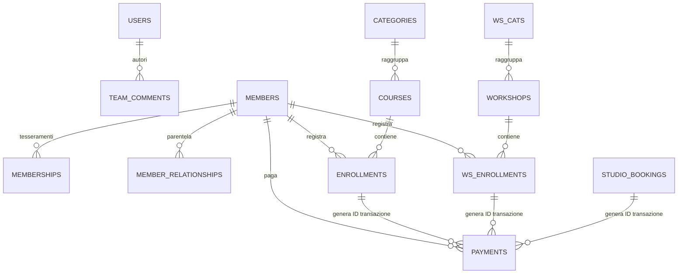
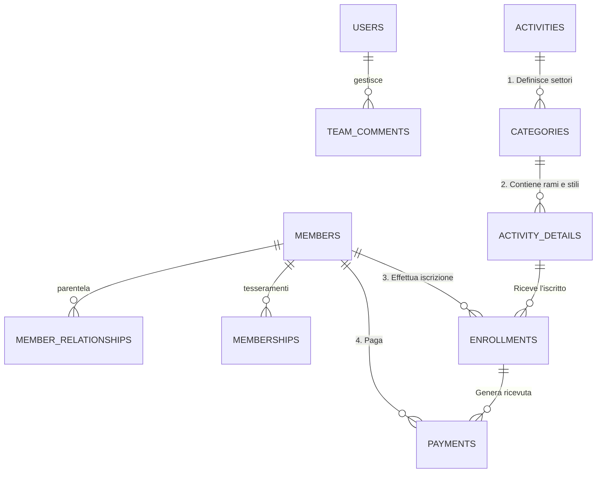

# Piano Lavoro e Analisi Architetturale: Transizione Database CourseManager

> [!CAUTION] 
> **Scopo di questo documento**
> Questo file è il **Manuale Operativo di Migrazione Dati (Fase 3)**. È la rigorosa checklist step-by-step che gli ingegneri del software dovranno seguire il giorno in cui verranno letteralmente cancellate le vecchie 30+ tabelle a Silos e attivate le 3 Tabelle Unificate SaaS. Contiene le istruzioni temporizzate su come effettuare i "Data Pump" (travasi di dati in sicurezza) senza perdere le vecchie contabilità o bloccare le segreterie.

Questa documentazione definisce in modo chiaro e inequivocabile lo stato attuale del database di CourseManager e la roadmap operativa per il passaggio alla nuova architettura unificata (Single Table Inheritance). 
Il presente documento funge da **programma lavorativo ufficiale per il team di sviluppo**. Contiene le mappe mentali ERD (attuale e futura) e una rigorosa checklist di tutti i passaggi necessari, completi di stime temporali. L'obiettivo primario di questa operazione è azzerare una volta per tutte il debito tecnico derivante dall'attuale frammentazione "a silos" e implementare un motore dati dinamico e infinitamente scalabile. Leggere attentamente l'intero flusso prima di iniziare i lavori di refactoring.

### 🔗 Documenti di Riferimento Architetturale (Da Leggere)
Per avere la visione d'insieme prima, durante e dopo il refactoring, fare affidamento ai seguenti documenti analitici stilati:
* 🗃️ **[CourseManager Database Map (Stato Attuale)](../attuale/01_GAE_Database_Attuale.md)** -> La radiografia visiva dell'ecosistema odierno a "11 silos". Spiega come tutto confluisce faticosamente nella tabella `payments`.
* 🛡️ **[Progetto, Architettura e Collegamenti (Regole Auree)](../attuale/02_GAE_Architettura_e_Regole.md)** -> Manuale per sviluppatori che spiega il nucleo "intoccabile" e le zone "sicure" dove espandere funzionalità oggi senza rompere nulla.
* 🚀 **[CourseManager Future Database Map (Single Table Inheritance)](12_GAE_Database_Futuro_STI.md)** -> Il traguardo finale. Il blueprint del nuovo "Dynamic Activities Engine" a 3 livelli unificati, senza più duplicazioni o pagamenti orfani.

---

## 1. Mappa Mentale: Stato di Fatto (Attuale: 73 Tabelle in 5 Moduli)

Attualmente, il gestionale conta ben **73 Tabelle Fisiche** ripartite in 5 macro-aree logiche. La struttura base utilizza un modello "a silos" per l'offerta didattica. Ogni tipologia di attività creata (Corsi, Workshop, Campus, Prove, ecc.) possiede tabelle dedicate per le proprie categorie, per i propri dettagli e per i propri iscritti. Questo porta all'esistenza di 11+ moduli paralleli quasi identici, i quali appesantiscono la manutenzione e obbligano la tabella fondamentale dei pagamenti (`payments`) a dover ospitare una moltitudine di Foreign Keys.

---

## 2. Mappa Mentale: Architettura Futura (Single Table Inheritance)

Il nuovo modello collassa i vecchi 12 silos orizzontali in un'unica gerarchia universale a 3 livelli: **Macro-Attività -> Categorie -> Singolo Corso/Dettaglio**. 
Questo centralizza i dati didattici e snellisce radicalmente la parte finanziaria. Tutto converge sulla macro-tabella `enrollments`.

---

## 3. Checklist Operativa e Programma Lavorativo (Refactoring Roadmap)

La transizione da un modello all'altro non è un'operazione banale, è un trapianto di cuore a sistema avviato. Il seguente programma di lavoro è stato delineato per minimizzare i rischi di corruzione dati o downtime. 
**Regola d'oro:** Tutto il lavoro deve svolgersi in un branch isolato (es. `feature/sti-architecture-revamp`).

### Fase 1: Modellazione Database e Preparazione ORM (In Esecuzione)
**[STATUS: SPRINT ATTIVO DA ESEGUIRE ORA]**
- [ ] Creazione del nuovo schema Drizzle ORM (`shared/schema.ts`) introducendo le 3 macro tabelle padri: `activities`, `categories`, `activity_details`.
- [ ] Creazione della nuova tabella convergente `enrollments` (Gestione iscritti universale universale).
- [ ] Refactoring tabella `payments`: snellimento drastico tramite rimozione delle 12 foreign key a croce e configurazione dell'unica foreign key verso la neo-tabella `enrollments`.
- [ ] Generazione della migrazione SQL (`npm run db:generate`). *(Non pushare ancora in produzione).*

### Fase 2: Script di Migrazione Dati "Data Pump" (Tempo stimato: 1.5 Giorni / 12 Ore)
- [ ] Scrittura script isolato Node.js (Data Pump) progettato per eseguire dump + read iterativo dai vecchi silos pre-esistenti (`courses`, `workshops`, `vacation_studies`, ecc.).
- [ ] Data-matching e insert automatico nelle nuove tabelle `activities` e `categories` (Lo script crea e definisce i "Corsi" o "Workshop" che prima erano hardcoded).
- [ ] Riversamento in batch massivo di tutte le righe specifiche (`courses` + `workshops` + ecc.) migrandole nella nuova `activity_details`.
- [ ] Mappatura delicata della vecchia contabilità: aggiornamento della tabella `payments` ricablando ogni vecchio target ID al nuovo UUID autogenerato su `enrollments`.
- [ ] Lancio di test di stabilità su snapshot di sviluppo per comprovare un'integrità referenziale al 100%.

### Fase 3: Riorganizzazione Routing e Backend / API Factory (Tempo stimato: 2 Giorni / 16 Ore)
- [ ] Pulizia drastica: eliminazione completa delle ~12 sezioni duplicate di rotte API contenute nel file `/server/routes.ts`.
- [ ] Implementazione del Pattern Architetturale "_API Factory_": programmazione logica di instradamento `/api/activities/:slug` che diriga e disbrighi automaticamente le chiamate backend verso le 3 sole macro-voci fisiche.
- [ ] Revisione e adattamento di tutte le query complesse che attingevano ai vecchi silos per la Dashboard, reportistica, presenze virtuali (`attendances`) e generazione note contabili.
- [ ] Inserimento dei validatori Zod attualizzati al nuovo schema.

### Fase 4: Refactoring Globale Frontend Interfacce (Tempo stimato: 1.5 Giorni / 12 Ore)
- [ ] Revisione massiva delle query uncinate in React-Query (`useQuery`, `useMutation`), uniformando la mappatura dati al Frontend in base ai JSON standardizzati emessi dal router Factory.
- [ ] Convergenza dei template visivi: accantonamento delle ripetitive e multiple `/src/pages/corsi.tsx`, `workshop.tsx`, ecc. in favore di un unico layout React dinamico.
- [ ] Riscrittura totale della `maschera-input-generale.tsx` (cuore dei pagamenti). La logica si baserà ora su semplici menù a tendina consequenziali in puro stile parent-child (Scelta Macro-Attività -> Scelta Categoria -> Scelta Singolo Corso del Detail).
- [ ] Verifiche puntuali su griglie iscrizioni (ex. component `iscritti_per_attivita.tsx`).

### Fase 5: QA e End-to-End Stress Testing (Tempo stimato: 1 Giorno / 8 Ore)
- [ ] Simulazione operativa a tutto spiano: dall'acquisizione utente nuovo alla registrazione pagamento rata.
- [ ] Test di retro-compatibilità garantita: controllo storico vecchie contabilità o iscrizioni. Tutto deve leggersi correttamente.
- [ ] Check con terminale nodemon per rilevare colli di bottiglia e un-handled promise rejections.

**Totale Tempo Stimato (Team Senior Developer): ~7 Giornate Lavorative (56 ore ometto l'overhead).**
*Informativa:* Durante l'avanzamento fino alla _Fase 2 compresa_, si esige il congelamento totale di feature che interessano il branch "main" da parte degli altri membri, onde evitare colossali conflitti di riscrittura GIT (merge conflicts) e derive sui dati di test.
