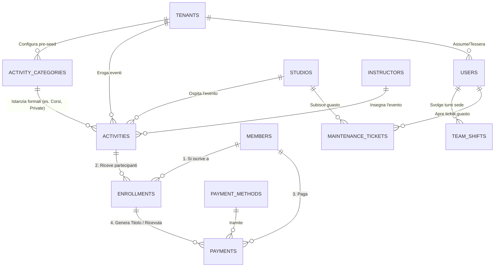

# CourseManager Future Database Map (Single Table Inheritance)

**Perché è stata stilata questa analisi?** 
Questa proposta architetturale nasce dall'esigenza di risolvere un problema strutturale acuto: la frammentazione delle Attività. Inizialmente, il sistema era stato concepito in modo grossolano (molto probabilmente hard-coded pensando a solo due o tre tipologie di offerta). Con l'espansione del gestionale e l'aggiunta logica di diverse ATTIVITÀ separate (12 fino ad oggi), questo design "a silos copiati" si è rivelato insostenibile da mantenere e soggetto a errori. Ora che abbiamo compreso che le "Attività" del centro (Corsi, Eventi, Workshop, Affitti) sono e saranno in continua, potenziale espansione, è fondamentale ripensare il cuore del database per assorbirle in modo dinamico.

Questo documento illustra la struttura futura di CourseManager, pensata per eliminare la frammentazione a "12 silos" e rendere il sistema scalabile all'infinito tramite un approccio unificato (Factory Pattern/Single Table Inheritance).

### 🔗 Documenti di Riferimento Architetturale (Da Leggere)
Per avere la visione d'insieme prima, durante e dopo i futuri refactoring, fai affidamento ai seguenti documenti analitici stilati:
* 🗃️ **[CourseManager Database Map (Stato Attuale)](../attuale/1_database_map_now.md)** -> La radiografia visiva dell'ecosistema odierno a "11 silos". Spiega come tutto confluisce faticosamente nella tabella `payments`.
* 🛡️ **[Progetto, Architettura e Collegamenti (Regole Auree)](../attuale/2_GAE_progetto_architettura_e_collegamenti_database.md)** -> Manuale per sviluppatori che spiega il nucleo "intoccabile" e le zone "sicure" dove espandere funzionalità oggi senza rompere nulla.
* 🛠️ **[Piano Lavoro Migrazione DB](5_GAE_PIANO_LAVORO_MIGRAZIONE_DB.md)** -> La checklist operativa con fasi e tempistiche stimate per passare dall'attuale struttura a quella futura.

---

## La Filosofia del Nuovo Sistema

L'obiettivo è trasformare il Gestionale da una struttura "rigida" (dove ogni nuovo corso richiede di clonare intere tabelle e file API) a una struttura Dinamica e Universale. Esistono due livelli in cui questa unificazione può avvenire:

1. **Unificazione Logica (Soft Refactoring - Factory API)**: Il database mantiene le 12 tabelle attuali per sicurezza, ma il Backend (Node.js) usa un unico motore (Factory) per gestirle tutte.
2. **Unificazione Fisica (Hard Refactoring - Single Table Inheritance)**: Il database stesso viene ricostruito per usare un'unica grande tabella `activities` e un'unica tabella `enrollments`.

Di seguito viene esplorata la Unificazione Fisica (La VERA mappa futura), che rappresenta lo stato dell'arte per un gestionale moderno.

---

## Logical Modules (Future State)

I moduli 1 (Authentication), 2 (Config), 3 (Locations), 4 (Team) e 7 (Memberships) rimarranno strutturalmente immutati rispetto allo stato dell'arte attuale.

---

## Logical Modules (Future State)

I moduli 1 (Authentication), 2 (Config), 3 (Locations), 4 (Team) e 7 (Memberships) rimarranno strutturalmente immutati rispetto allo stato dell'arte attuale.

Il cambiamento massivo avviene sui **Moduli 5, 6 e 8** (Anagrafiche, Attività e Pagamenti), che verranno rifondati e centralizzati.

### 5. Core Entities (Immutato, con agganci semplificati)
- **`members`**: The heart of the system.
- **`instructors`**: Teachers.
- **`studios`**: Physical rooms/halls.

### 6. The Unified Activity Engine (SaaS / Single Table Inheritance)
Tutto l'apprendimento, insegnamento e l'offerta al pubblico si condenserà in sole 4 super-tabelle scalabili (agnostiche) disegnate nel draft Drizzle V2:

1. **`tenants` (Root Aziendale / Whitelabeling)**
   - Definisce la Palestra/Scuola che usa l'applicativo. Contiene Logo, Colori Aziendali e customizzazione del menu (`custom_menu_config`).
   
2. **`activity_categories` (Il "Pre-Seed" e UI Router)**
   - Non solo testuale ("Danza"), ma contiene la colonna vitale `ui_rendering_type` che istruisce il frontend su come stampare i form, accompagnata dal payload JSON `extra_info_schema` per i campi volanti (es. Taglia Maglietta).

3. **`activities` (La Super-Tabella Eventi)**
   - Unica tabella fisica che sostituisce i famigerati 11 Silos. Contiene Corsi, Affitti, Eventi Esterni.
   - *Key Columns:* `tenant_id`, `category_id`, `location_id`, `start_time`, `end_time`, `instructor_id`, `max_capacity`, `base_price`, `extra_info_overrides` (JSON).

4. **`enrollments` (L'Iscrizione Universale)**
   - Registra le partecipazioni di chiunque a qualsiasi `activity_id`.
   - *Key Columns:* `status` (active, waiting_list, frozen), `remaining_punch_cards` (Carnet ingressi), `wallet_credit` (Buoni Rimborso), prelevando il metadata JSON dalla categoria padre.

### 8. Gestione Operative & HR (Il Modulo Staff e Ticketing)
In ottica Enterprise, il sistema astrae la logica del team da quella didattica tramite due moduli dedicati:
- **`team_shifts`**: Griglia temporale dedicata all'amministrazione per le timbrature presenze (Payroll).
- **`maintenance_tickets`**: Segnalazioni guasti sale/facilities gestibili dallo Staff con transizioni di stato.

### 9. Finances & Payments (Rivoluzionato)
- **`payments`**: La transazione contabile. Nel nuovo sistema **non avrà più 12 colonne FK orfane**.
- Punterà esclusivamente alla combo: `member_id` e id di `enrollments`. Si aggiungono hook API per **Registratori Telematici Fiscale** e logiche ricorrenti per **Stripe/SEPA**.

---

## Entity-Relationship Diagram (Future ERD)

Questo diagramma evidenzia la spiccata verticalità e l'ordine relazionale rispetto all'approccio orizzontale espanso odierno.

### Key Architectural Improvements (Sintesi dei Benefici)
1. **Zero Duplicate Code:** Non serve fare "Copiare `courses.ts` e incollarlo per fare `summer_camps.ts`". Creazione di nuove classi di attività avviene in 1 click dal Front-End Amministratore.
2. **Centralizzazione Backend API:** I metodi `GET`, `POST`, `PUT`, `DELETE` delle attività diventeranno polimorfici (`/api/activities/Corsi/...`), serviti da un Pattern _Factory_ in grado di generare JSON omologati.
3. **Integrità Contabile Totale:** La tabella `payments` è l'origine di tutti i report. Più è snella e meno foreign key sparse ha, meno si inceppa tra frontend, ricalcoli e UI.
